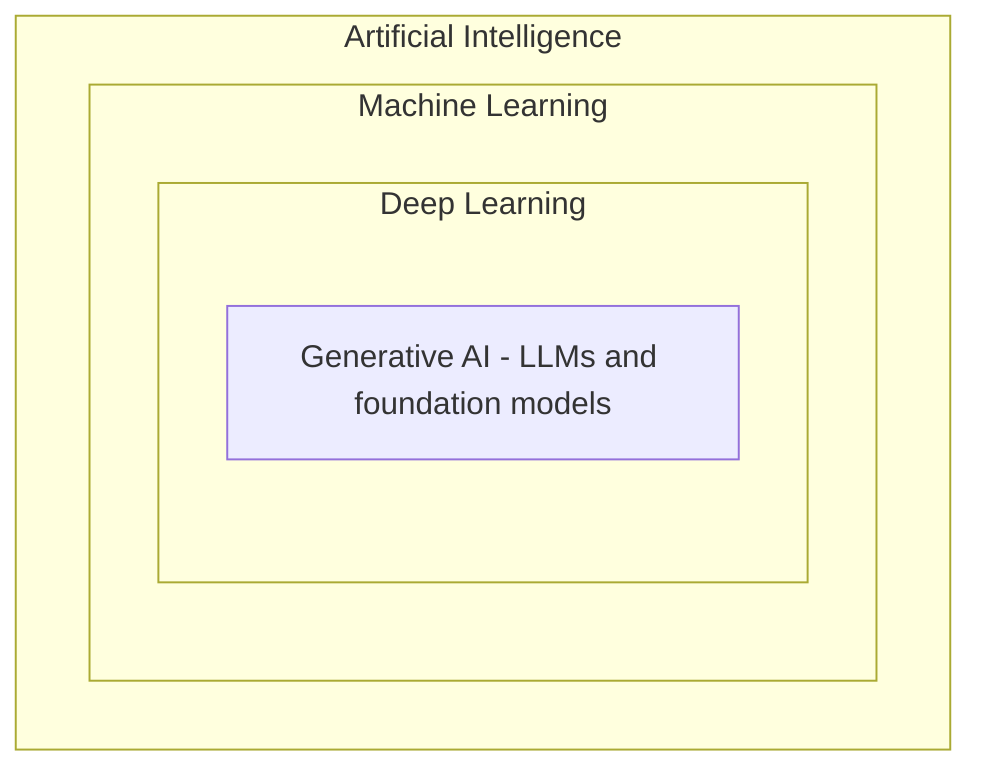

You don't need to build AI models to build powerful things with them. This page places the
key terms so the rest makes sense — no math required.

## The nesting: AI ⊃ ML ⊃ DL ⊃ GenAI

- **AI** — the broad goal of getting software to do "intelligent" tasks.
- **ML (machine learning)** — AI that learns patterns from data instead of hard-coded rules.
- **DL (deep learning)** — ML using large neural networks.
- **Generative AI** — DL models that *create* content (text, images, code). Large language
  models (LLMs) and other [foundation models]()
  live here.

## What changed with foundation models

They're pre-trained on huge data, general-purpose, and used through an API or a prompt. You
don't collect data or train them — you **use** them and adapt their behavior with prompts,
your own data (RAG), and tools.

## Your role as a builder

The job is **orchestration**, not training: wiring models into software, tools, and
automation, then controlling and evaluating their output. The skills that matter: prompting,
context/RAG, tool & agent design, guardrails, evaluation, and cost/latency awareness.

## What you don't need (for now)

Training algorithms, gradient descent, model architecture internals. Useful background later
— not required to ship.
