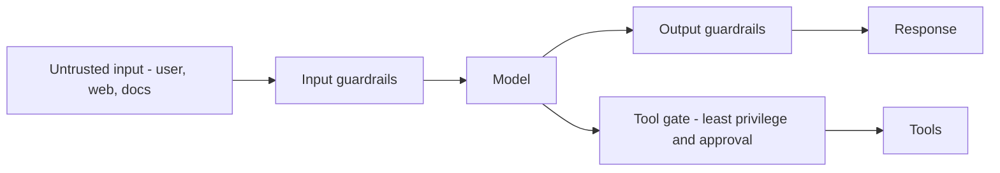

Builds on [Guardrails](). LLM apps add a new attack
surface: the model follows **natural-language instructions**, and it can't reliably tell your
instructions from an attacker's hidden in the data it reads.

## Why it's different

Any text the model sees — a user message, a web page, a retrieved document, a tool result —
can *contain instructions*. If the model treats attacker text as commands, you have a problem
no input-validation regex catches.

## Key threats

- **Prompt injection** — malicious instructions in the input. *Direct* (the user types them)
  or *indirect* (hidden in a web page or document the model retrieves — the dangerous one).
- **Jailbreaks** — prompts that bypass the model's safety training.
- **Data leakage / exfiltration** — tricking the model into revealing secrets, system prompts,
  or other users' data.
- **Excessive agency** — an agent with broad tool access doing damage (deleting data, sending
  messages) when manipulated.
- **PII exposure** — sensitive personal data flowing into prompts, logs, or training.
- **Supply chain** — untrusted models, tools, or MCP servers.

## Defenses

- **Least privilege for tools** — grant the minimum; gate destructive actions behind human
  approval (see [Tool & function calling]()).
- **Treat retrieved/tool content as untrusted** — never as instructions. Separate it clearly
  from your directives.
- **Input & output guardrails** — moderation, PII redaction, format/grounding checks.
- **Never put secrets in prompts** — they persist in history and logs.
- **Defense in depth** — no single filter is enough; assume injection will sometimes get
  through and limit the blast radius.
