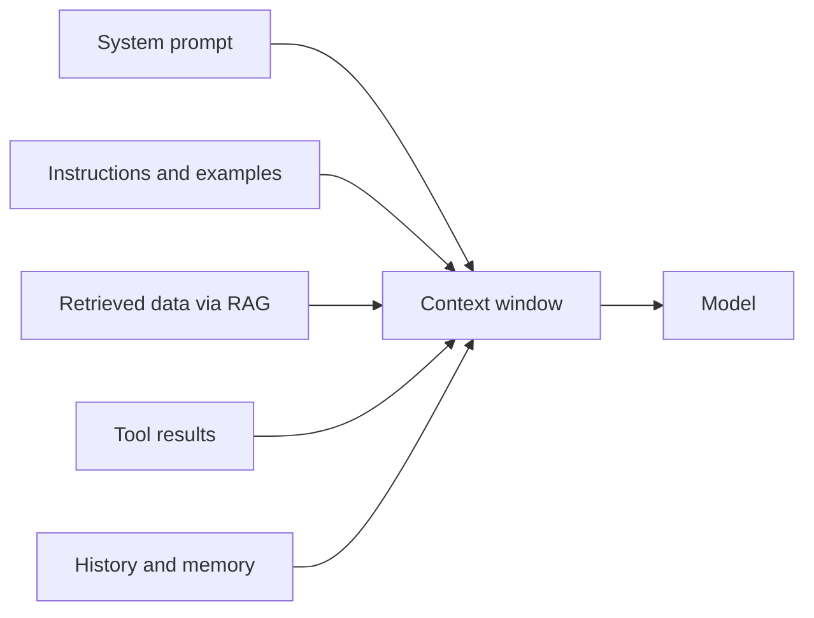

Builds on [Prompt engineering](). Prompting is
*wording* the request; **context engineering** is deciding *everything* the model sees in its
finite [context window](/foundations/how-llms-work/) — and what to leave out.

## What's in the context

- **System prompt** — role, rules, output format.
- **Instructions / examples** — the task and any few-shot samples.
- **Retrieved data** — documents pulled in via [RAG]().
- **Tool results** — output from [tools the model called]().
- **History / memory** — prior turns, or facts carried across sessions.

## The core problem: the window is finite

Everything above competes for the same token budget. More is not better — irrelevant context
distracts the model and costs money. The goal is the **right** information, not the most.

## Techniques

- **Retrieval** — fetch only the passages relevant to *this* request (RAG).
- **Summarization / compaction** — condense old turns when a conversation grows long.
- **Pruning** — drop stale tool results and history the model no longer needs.
- **Ordering & caching** — put stable content first so it can be cached and reused cheaply.

## Example — lean vs. bloated context

For the question *"What's our refund window?"*:

- ❌ **Bloated** — the whole 40-page policy PDF + the entire chat history. Noisy, expensive, and
  often a worse answer.
- ✅ **Lean** — just the one retrieved paragraph about refunds + the question. Precise and cheap.

## Why it matters to you

Most "the model got it wrong" problems are really context problems: it lacked the right
information, or drowned in the wrong information. Fix the context before blaming the model.
