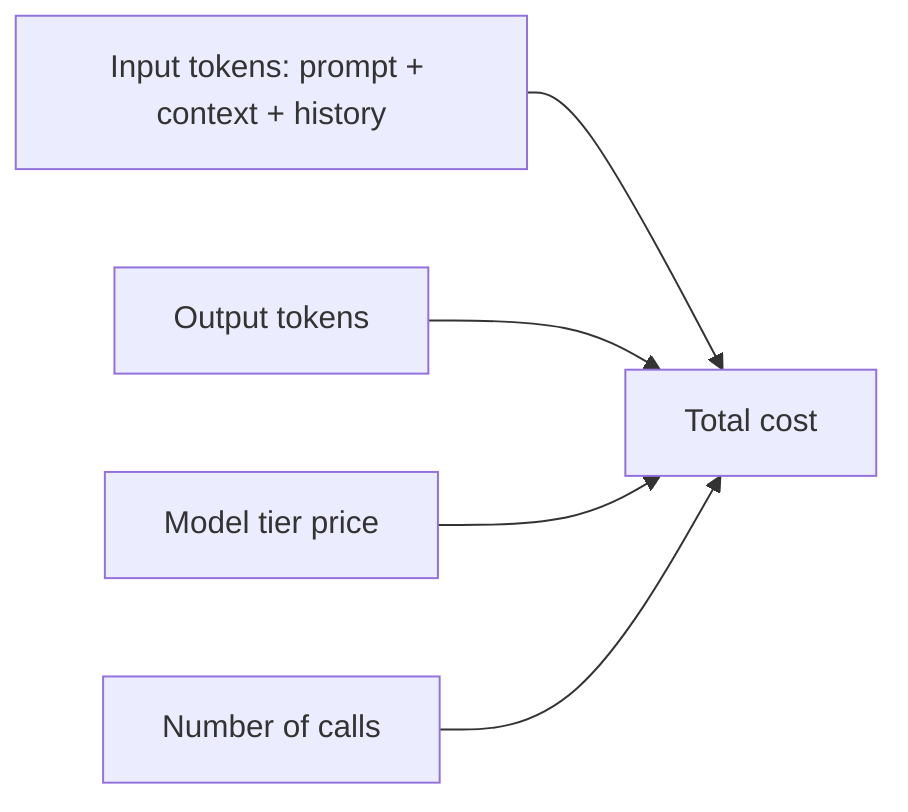

You pay per **token** — input and output, priced separately. Cost is easy to reason about once
you see what feeds it.

## What drives cost



- **Input tokens** — your system prompt, retrieved [context](),
  and the whole conversation history you resend each turn.
- **Output tokens** — usually priced higher than input.
- **Model tier** — a flagship model can cost 10×+ a small one (see
  [Choosing a model]()).
- **Number of calls** — [agents]() multiply calls; a
  loop can be many requests per task.

## Example — a rough cost calc

```text
Support bot, per reply:
  input  = 2,000 tokens (system + context + question)
  output =   300 tokens
Illustrative price: $3 / 1M input, $15 / 1M output
  input  = 2000/1e6 × $3  = $0.0060
  output =  300/1e6 × $15 = $0.0045
  → ~$0.011 per reply  ≈ $11 per 1,000 replies
```

Prices are illustrative — check your provider's. The point: input tokens (context + history)
usually dominate.

## The levers

- **Right-size the model** — use a smaller tier where quality holds.
- **Trim context** — send only what's relevant; don't dump whole documents.
- **Cap `max_tokens`** — bound the output.
- **Prompt caching** — reuse a stable prompt prefix across calls to cut input cost.
- **Batch** offline work; **stream** for UX (doesn't cut cost, improves perceived latency).

## Estimating and tracking

- Count tokens with a tokenizer before you ship (don't guess).
- Watch real token usage in [Observability]() — the
  API returns `usage` on every response.

> Rule of thumb: the cheapest token is the one you don't send. Most cost problems are context
> problems.
