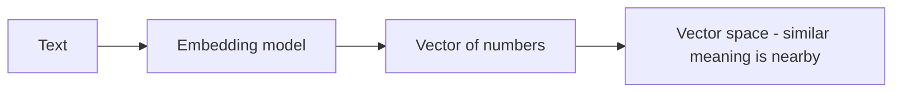

An **embedding** turns text (or an image, or audio) into a list of numbers — a **vector** —
that captures its *meaning*. It's the mechanism behind
[RAG](), but it's useful far beyond that.

## The core idea

Text with similar meaning maps to **nearby** vectors; unrelated text maps far apart. "cat"
and "kitten" land close together; "car" lands elsewhere. That's the whole trick — meaning
becomes distance you can measure.

## How you use them

- Use the **same embedding model** for everything you compare — vectors from different models
  aren't comparable.
- Measure closeness with **cosine similarity** (angle between vectors).
- Store and search them in a **vector database** (see [RAG]()).

## Uses beyond RAG

- **Semantic search** — find by meaning, not keywords.
- **Clustering** — group similar items automatically.
- **Classification** — label text by nearest known examples.
- **Deduplication** — spot near-duplicate content.
- **Recommendations** — "more like this".

## Practical notes

- **Dimensions** — vectors have a fixed length (e.g. hundreds to thousands of numbers); more
  isn't always better.
- **Model choice** matters — pick one suited to your language and domain.
- Embeddings are **cheap** compared to generation; embedding a large corpus is routine.
