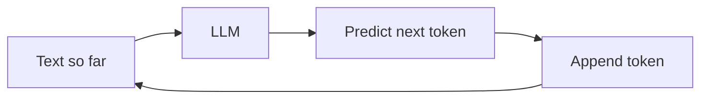

You don't need the math, but a few mechanics explain most of what you'll hit as a builder.

## Tokens

Models don't read characters or words — they read **tokens**, chunks of text (roughly ¾ of a
word in English). "Tokenization" is the step that splits text into tokens. Everything is
counted and billed in tokens: your input **and** the model's output.

**Example** — the same text, as the model sees it:

```text
"AI is unbelievable"  →  ["AI"][" is"][" un"]["bel"]["iev"]["able"]
```

Three words become six tokens: common words are one token, rarer or longer words split into
pieces. That's why token count ≠ word count.

## Next-token prediction

An LLM does one thing: given the text so far, predict the **next token**, append it, and
repeat. That's it.



This is why:

- Output is **probabilistic** — same prompt can give different answers.
- Models can be fluent yet wrong (they predict plausible text, not verified truth).

## The context window

The **context window** is the maximum tokens the model can consider at once — and **input +
output share the same budget**. A long prompt leaves less room for the answer. When a
conversation outgrows the window you must trim, summarize, or retrieve (see
[Context engineering]()).

## Knowledge cutoff

A model only knows what it saw during training, up to a **cutoff date**. It has no live
knowledge of your data or recent events — which is exactly what
[RAG]() and tools are for.

## Why this matters to you

- You pay per token → concise prompts and caching save money.
- Context is finite → manage what you put in it.
- Output is probabilistic → validate, and use [evaluation]().
