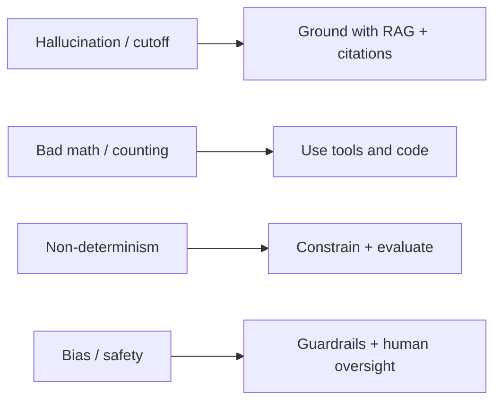

Knowing *how* models fail tells you *what to add* around them. None of these are bugs — they
follow from [how LLMs work]().

## The main failure modes

| Failure mode | What it is | Mitigation |
| -------------- | ----------- | ------------ |
| Hallucination | Confident but false or unsupported output | [RAG]() + citations; ask for "I don't know" |
| Knowledge cutoff | No knowledge of recent or private facts | RAG, tools, web search |
| Bad at exact math / counting | Predicts plausible tokens, doesn't compute | Give it [tools / code]() |
| Non-determinism | Same prompt → different answers | Lower temperature, constrain output, [evaluate]() |
| Prompt sensitivity | Small wording changes shift results | Test prompts against an eval set |
| Bias | Reflects biases in training data | [Responsible AI]() review, human oversight |
| Context limits | Forgets or drops info beyond the window | [Context engineering]() |

## The pattern

## The takeaway

A model alone is unreliable for facts, math, and consistency. You make it reliable by
**surrounding it** — grounding it in data, giving it tools, constraining its output, and
measuring it. That's what the rest of this stage is about.
