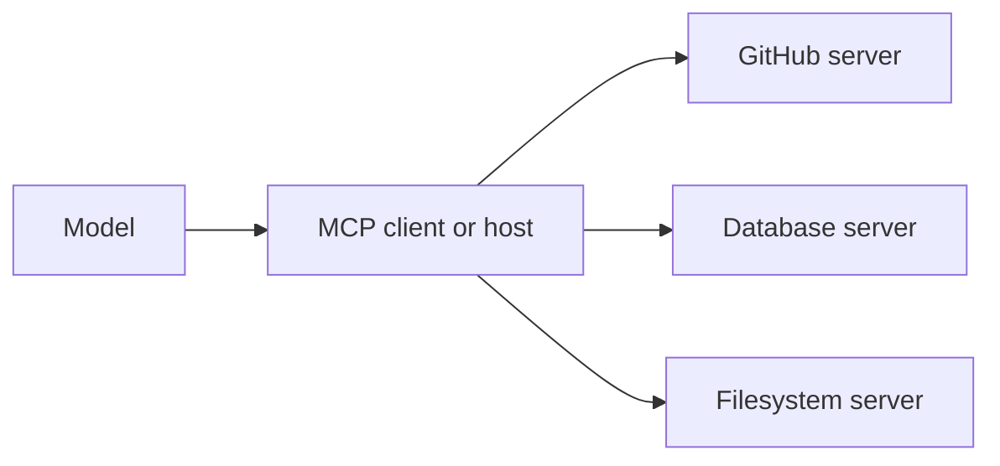

**MCP (Model Context Protocol)** is an open standard for connecting models to external tools
and data. Think of it as a common plug: instead of hand-wiring every integration, you connect
to MCP servers that expose capabilities in a standard shape.

## The problem it solves

Before MCP, every app wired up [tools]() and
data sources in its own bespoke way. N apps × M integrations meant rebuilding the same
connectors over and over. MCP standardizes the interface so an integration is written **once**
and reused by any MCP-compatible app.

## How it fits together

- **MCP server** — exposes capabilities (a GitHub server, a database server, a filesystem
  server, …).
- **MCP client / host** — the app or agent that connects to servers and makes their
  capabilities available to the model.

A server can expose three things:

- **Tools** — functions the model can call (see [Tool & function calling]()).
- **Resources** — data/context the model can read (files, records).
- **Prompts** — reusable prompt templates.

## Why it matters to you

- **Reuse over rebuild** — connect to an existing server instead of writing a connector.
- **Portability** — the same server works across any MCP-compatible client.
- **It's the backbone of the ecosystem** — many "connectors", "skills", and "plugins" are MCP
  servers under the hood.

Building your own server is a Stage 2 topic — see
[Tooling & frameworks]().

## Strengths & limitations

- **Strengths** — an integration is written once and reused by any MCP-compatible app; a
  growing catalog of ready-made servers; one standard shape (tools, resources, prompts)
  instead of bespoke glue per app.
- **Limitations** — every server you connect **extends your attack surface**: a malicious or
  compromised server can feed the model instructions or leak what the model sends it (the
  supply-chain threat in [AI security]()); permissions
  are often coarser than the task needs — prefer servers with narrow scopes; and the standard
  is young, so auth and transport details are still maturing.

## Sources

- [Model Context Protocol — Introduction](https://modelcontextprotocol.io)
- [Model Context Protocol — Specification (2025-06-18)](https://modelcontextprotocol.io/specification/2025-06-18)
