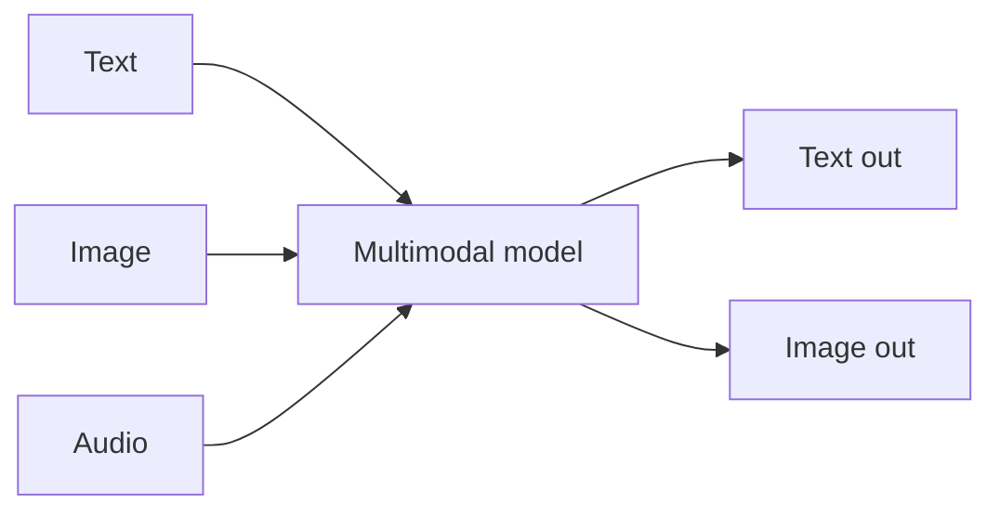

Modern models aren't text-only. A **multimodal** model can take — and sometimes produce —
images, audio, or video alongside text. Many tools you use (coding agents that read
screenshots, chat that "sees" a photo) rely on this.

## Input vs output modalities

- **Vision** — image *in*, text out (describe a chart, read a screenshot, extract from a PDF).
- **Image generation** — text *in*, image out.
- **Speech** — audio ↔ text (transcription, voice interfaces).

A model supports a specific set of these — check before you rely on one.

## Why it matters to builders

- Turn a **screenshot or design** into code.
- **Document / PDF understanding** — invoices, forms, diagrams.
- **Chart & table reading** for data extraction.
- **Voice** interfaces via speech-to-text and text-to-speech.

## Practical notes

- You send images **in the same `messages`** as text (see [The AI API]()).
- Images cost **tokens too** — often a lot; higher resolution = more tokens.
- One multimodal model is convenient; specialized models can be better or cheaper for a single
  modality. This is a [model-choice]() trade-off.
