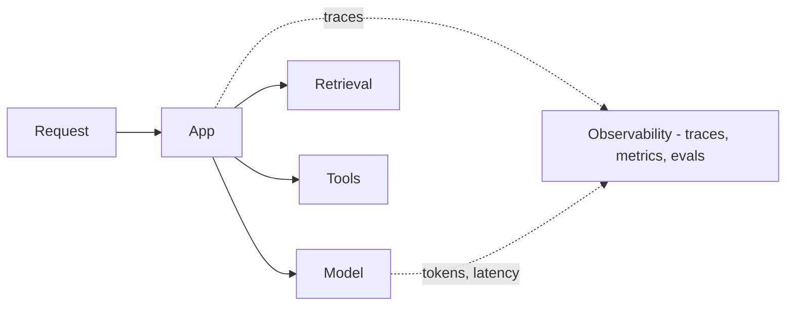

Builds on [Model evaluation](). Evaluation asks
*is it good?*; **observability** asks *what actually happened in production, and why?* Because
output is non-deterministic, you can't debug an AI system you can't see into.

## What to capture

- **Traces** — the full step-by-step of a request: the prompt, retrieved context, each tool
  call and result, and the final output. This is what you replay when something goes wrong.
- **Metrics** — latency, token usage, **cost**, and error / refusal rates over time.
- **Quality signals** — user feedback (thumbs up/down), task success, and **online evals**
  (scoring a sample of real traffic, often with [LLM-as-judge]()).

## Why it matters

- **Debugging** — a bad answer could come from retrieval, the prompt, a tool, or the model;
  only a trace tells you which.
- **Cost control** — tokens are money; you can't manage what you don't measure.
- **Drift** — quality can change when data, prompts, or the model version change; online evals
  catch it.

## Offline vs. online

Offline evals (in [CI]()) catch regressions
before shipping; observability catches what real users hit *after*. You need both.
