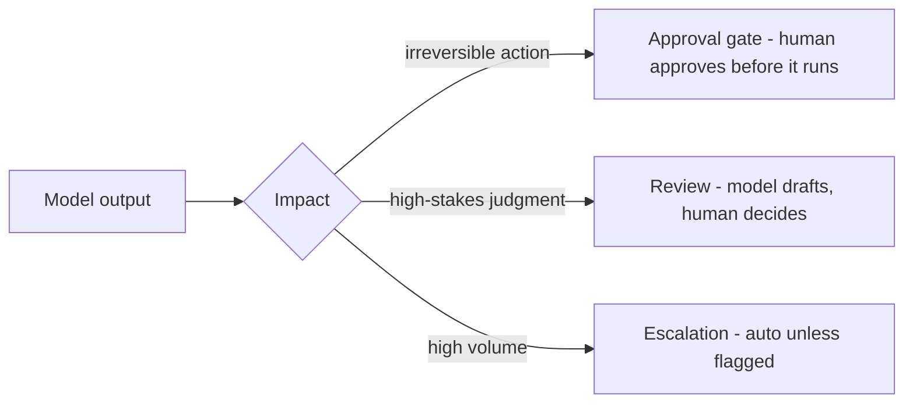

## Goal

Decide **how much autonomy** an AI feature gets based on its impact — and keep enough
evidence to explain any decision later. Responsible AI is not a policy document; it's a set
of design decisions: where a human sits in the loop, what gets logged, and what you test
before launch.

## Match autonomy to impact

| Impact of a wrong output | Examples | Pattern |
| ------ | ------ | ------ |
| **Low** — internal, reversible | code suggestion, draft email, meeting summary | Full autonomy; log for debugging |
| **Medium** — user-facing content | support answers, product copy | Autonomy + [guardrails](); review a sample |
| **High** — a person's money, rights, or health | hiring screens, credit limits, medical triage | AI assists; a **human makes the final call** |

Regulation is converging on the same idea: the EU AI Act classifies systems by risk tier, and
NIST's AI RMF frames the work as mapping and managing risk — both start from *impact*, not
from the technology.

## Three ways to put a human in the loop

- **Approval gate** — the model *proposes* an action; a human approves before it executes.
  For irreversible or external effects: sending money, deleting records, emailing a customer.
- **Review** — the model drafts; the human finalizes and owns the result. For high-stakes
  judgments: a hiring shortlist, legal wording, medical guidance.
- **Escalation** — the system acts alone by default and hands off when a guardrail fires or
  confidence is low. For high volume: support bots, content moderation. Cheapest of the
  three, but only as good as its trigger.

## Example — the hiring screen, done responsibly

An AI ranks 500 job applications. A responsible version looks like this:

- The model produces a shortlist **with reasons**; a recruiter makes the final call (review
  pattern).
- Before launch, the team compares rankings across groups on an eval set (**bias testing**):
  does it systematically down-rank anyone?
- Every screen logs the model and prompt version, the input, the output, and who approved —
  so any candidate's outcome can be reconstructed later.

## What to log for auditability

The audit question is *"why did the system decide this, for this person, on that day?"* You
can answer only if each decision records:

- **What the model saw** — the input plus any retrieved context.
- **What produced it** — model and prompt version.
- **What came out** — output, confidence, guardrail verdicts.
- **Who signed off** — the human decision, if there was one, and what they changed.

This is the same machinery as [observability]();
the difference is retention and purpose. Debug traces are for you — audit logs must survive
and make sense to an outsider.

## Transparency, explainability, interpretability

Three terms that get conflated. **Transparency** is disclosing how the system is built and
evaluated. **Explainability** is justifying a *specific* output — for LLM systems this
usually means showing sources, which is one reason RAG citations matter. **Interpretability**
is understanding the model's internals — rarely available with LLMs, which is exactly why the
other two carry the weight.

Hallucination, toxicity, and prompt injection are covered where they're fought:
[limitations](),
[guardrails](), and
[AI security]().

## Strengths & limitations (of human oversight)

- **Strengths** — catches failures automation can't see (context, fairness, edge cases);
  creates accountability that survives an audit; it's what makes AI usable in regulated
  domains at all.
- **Limitations** — costs latency and throughput; reviewers rubber-stamp under volume
  (**automation bias**) — track how often they disagree with the model, because a 0% override
  rate means the review isn't real; oversight added everywhere dulls attention where it
  matters — place gates by impact, not by default.

## Sources

- [NIST — AI Risk Management Framework (AI RMF 1.0)](https://www.nist.gov/itl/ai-risk-management-framework)
- [NIST — AI RMF: Generative AI Profile](https://www.nist.gov/publications/artificial-intelligence-risk-management-framework-generative-artificial-intelligence)
- [EU — Artificial Intelligence Act (Regulation 2024/1689)](https://eur-lex.europa.eu/eli/reg/2024/1689/oj)
