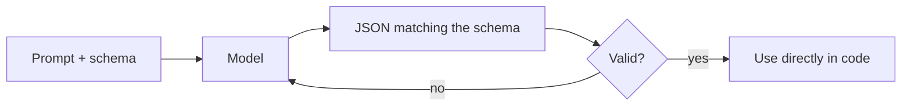

Builds on [The AI API](). To *build* with a model you
usually need output your code can parse — not prose. **Structured outputs** constrain the
model's answer to a **schema** (usually JSON).

## The idea

You give a schema; the model returns data that matches it; you validate and use it directly.



## Example

Schema (what you ask for):

```json
{ "type": "object",
  "properties": {
    "sentiment": { "type": "string", "enum": ["positive", "neutral", "negative"] },
    "score": { "type": "number" }
  },
  "required": ["sentiment", "score"] }
```

Output (what you can rely on):

```json
{ "sentiment": "positive", "score": 0.82 }
```

No string-parsing, no "sometimes it adds a sentence before the JSON."

## How it's done

- **JSON / schema mode** — the API constrains decoding to valid JSON for your schema.
- **Tool arguments** — a [tool call]()'s
  inputs are structured outputs too; same mechanism.
- **Validate + retry** — always validate; on a mismatch, re-ask.

## Why it matters

Structured outputs are what make an LLM a **reliable component** in a pipeline — classification,
extraction, routing, or any step whose result feeds other code.
