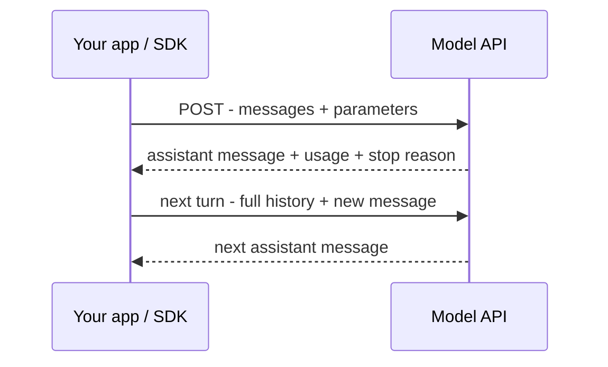

Everything you build talks to a model through an **API**: you send messages over HTTP and get
a generated response back. Most providers share the same shape, so the concepts here transfer.

## The request/response cycle



## The request

You send the model id, the conversation as a list of **messages**, and a few
[parameters]():

```json
{
  "model": "<model-id>",
  "max_tokens": 1024,
  "messages": [
    { "role": "system", "content": "You are a helpful assistant." },
    { "role": "user", "content": "Summarize this in one sentence: ..." }
  ]
}
```

## The three roles

- **system** — standing instructions: who the model is, rules, output format.
- **user** — input from the person or your app.
- **assistant** — the model's own replies. In a multi-turn chat you send the *previous*
  assistant turns back so it remembers.

## The response

```json
{
  "role": "assistant",
  "content": "The document argues that ...",
  "usage": { "input_tokens": 812, "output_tokens": 24 },
  "stop_reason": "end_turn"
}
```

- **content** — the generated text (or tool calls — see
  [Tool & function calling]()).
- **usage** — tokens in/out, which is what you're billed on.
- **stop_reason** — why it stopped (finished, hit `max_tokens`, wants a tool, …).

## Streaming

Instead of waiting for the whole answer, you can **stream** tokens as they're generated — much
better UX for long outputs, and it avoids request timeouts.

## Stateless — you resend history

The API has **no memory** between calls. Each request must include the full conversation you
want the model to see; managing that is [context engineering]().

## SDKs

You rarely hand-write HTTP. Each provider ships an **SDK** (a library) that wraps these calls
in your language. Exact field names vary by provider — the concepts (messages, roles, usage,
streaming) do not.
