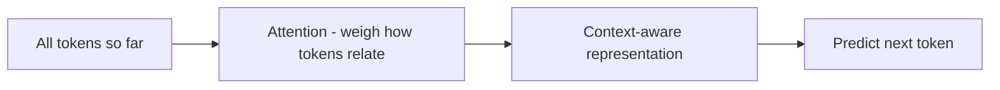

Builds on [How LLMs work](). You don't need this to
build, but a light mental model of *what's inside* explains a lot of the behavior you'll see.

## Attention, in one idea

LLMs are **transformers**. The key trick is **attention**: to predict the next token, the
model looks at *all* the tokens so far and weighs how much each one matters to the current
step. "It" gets linked to the noun it refers to; a question gets linked to the relevant fact
earlier in the prompt.

## Why this explains the behavior you see

- **Context is everything** — the model has no memory beyond what's in the window; attention
  works over exactly that text. More relevant context → better answers (and more cost).
- **Order and phrasing matter** — attention is sensitive to how things are worded and placed;
  that's why [prompting]() and
  [context engineering]() work.
- **Cost grows with length** — attention compares tokens against each other, so long inputs are
  disproportionately expensive.
- **No true understanding** — it's pattern prediction, not comprehension, which is why models
  can be confidently wrong (see [Limitations]()).

That's the whole point of this page — awareness, not implementation. The math is optional.
