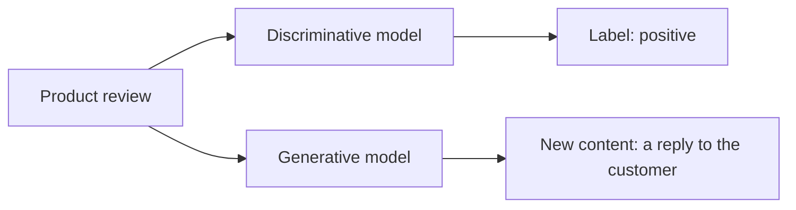

## Goal

Own one distinction: models that **create** content versus models that **label** it. It
sounds academic but it decides real architecture: which problems need an LLM at all, and
which are cheaper solved another way.

## Generative vs. discriminative

- A **discriminative** model maps input → label or score: spam / not-spam, fraud risk 0.83,
  positive / negative.
- A **generative** model maps input → *new content*: text, images, audio, video, code.

Same input, different job: the discriminative model *labels* the review; the generative model
*writes the reply*.

## Why the distinction matters to a builder

- **Not every problem needs generation.** Classify tickets, score leads, detect fraud —
  discriminative tasks. An LLM can do them (and is a fast way to prototype), but a small
  classifier is often cheaper, faster, and more predictable at scale.
- **Generative output is probabilistic** — the same prompt can yield different answers. Great
  for drafting and brainstorming; a liability where there is exactly one right answer, which
  is why [structured outputs]() and
  [evaluation]() exist.
- **Generation is the interface change.** Pre-GenAI, ML gave you predictions to build UI
  around; now the model produces the artifact itself — the email, the code, the summary.

## Strengths & limitations

- **Strengths** — one model covers drafting, summarizing, translating, coding, brainstorming;
  no task-specific training needed — a prompt reshapes the behavior.
- **Limitations** — output varies run to run; it optimizes for *plausible*, not *true* (see
  [Limitations]()); for pure labeling at scale it can
  be an expensive way to do a cheap job.

> Foundation models are the engines; generative AI is what they do when producing content.

## Sources

- [Google Cloud — What is Generative AI?](https://cloud.google.com/use-cases/generative-ai)
