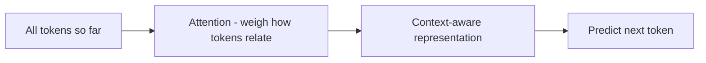

Builds on [How LLMs work](). You don't need this to
build, but a light mental model of *what's inside* explains a lot of the behavior you'll see.

## Attention, in one idea

LLMs are **transformers**. The key trick is **attention**: to predict the next token, the
model looks at *all* the tokens so far and weighs how much each one matters to the current
step. "It" gets linked to the noun it refers to; a question gets linked to the relevant fact
earlier in the prompt.

## Example — what attention resolves

*"The trophy didn't fit in the suitcase because **it** was too big."*

What does *it* refer to? You instantly know: the trophy — because *didn't fit* and *too big*
point there. Swap in *too small* and *it* flips to the suitcase. Attention is the mechanism
that weighs those relationships between tokens, which is how the model gets this right
without any grammar rules.

## Why this explains the behavior you see

- **Context is everything** — the model has no memory beyond what's in the window; attention
  works over exactly that text. More relevant context → better answers (and more cost).
- **Order and phrasing matter** — attention is sensitive to how things are worded and placed;
  that's why [prompting]() and
  [context engineering]() work.
- **Cost grows with length** — attention compares tokens against each other, so long inputs are
  disproportionately expensive.
- **No true understanding** — it's pattern prediction, not comprehension, which is why models
  can be confidently wrong (see [Limitations]()).

## Sources

- Vaswani et al., *Attention Is All You Need* (2017) — [arXiv:1706.03762](https://arxiv.org/abs/1706.03762)
