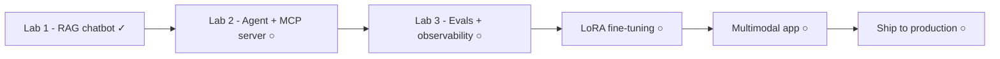

If [Foundations]() explained the pieces and
[Building]() showed the architectures, **Stage 3** is where you
type. Every lab is incremental: each step runs and is verified before the next begins,
because that's how production systems actually grow.

## Roadmap

## The labs

1. [Lab 1 — RAG chatbot on your own documents]() ✓
   — infra → ingestion → keyword search → hybrid → full RAG → monitoring + cache → agentic.
2. ○ **Lab 2 — an agent with tools + a hand-written MCP server.**
3. ○ **Lab 3 — an eval harness + observability** for labs 1–2.
4. ○ **Practical fine-tuning (LoRA)** — adapt a small model for tone and schema.
5. ○ **A multimodal app** — vision input, document extraction.
6. ○ **Ship to production** — deployment, cost control, monitoring.

## Prerequisites

Work through the [RAG thread]() of Stages
0–2 first — the labs assume the concepts and reference them instead of re-explaining.
