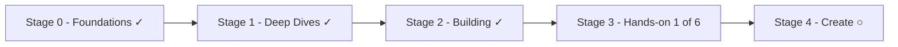

This vault is a **living map**, not a finished book. The goal is to go beyond *using*
ChatGPT or Claude: **understand** how these systems work, **master** the techniques that
matter, **build** real systems, and eventually **ship** hands-on projects. Written pages are
marked ✓; planned ones ○ — they get filled in as I learn.

## The journey

Read **across** to progress stage by stage, or pick a row in the
[threads table](#follow-one-topic-in-depth) below to go deep on one topic.

## Stage 0 — Foundations ✓

28 concepts in [five ordered modules](), from *what models are*
to *operating them in production*:

1. **Understand** — the landscape, generative AI, foundation models, how LLMs work, training,
   multimodality, limitations.
2. **Work with a model** — the API, parameters, prompting, context, structured outputs,
   reasoning models, cost, choosing a model.
3. **Ground it in your data** — embeddings, RAG.
4. **Make it act** — tools, agents, agentic AI, MCP, AI coding assistants.
5. **Operate & govern** — guardrails, security, evaluation, observability, responsible AI.

## Stage 1 — Deep Dives ✓

[Eleven dives]() along the same spine:
[prompt patterns]() ·
[vector databases]() ·
[types of RAG]() ·
[advanced RAG]() ·
[agent patterns]() ·
[agent memory]() ·
[multi-agent systems]() ·
[self-improving agents]() ·
[computer use]() ·
[adaptation]() ·
[evaluation in practice]().

## Stage 2 — Building with AI ✓

[Nine pages]() that assemble the pieces:
[AI system design]() ·
[scaling to production]() ·
[building RAG]() ·
[agentic RAG]() ·
[the agent harness]() ·
[loop engineering]() ·
[from prompts to graphs]() ·
[AI code structure]() ·
[tooling & frameworks]().

## Stage 3 — Hands-on (in progress)

[Real projects](), built incrementally:

1. ✓ **[Lab: a RAG chatbot over my own documents]()**
   — in seven steps: infrastructure → ingestion → keyword search → hybrid search → full RAG →
   monitoring + caching → agentic upgrade.
2. ○ **Lab: an agent with tools + a hand-written MCP server.**
3. ○ **Lab: an eval harness + observability** for labs 1–2.
4. ○ **Practical fine-tuning (LoRA)** — adapt a small model for tone and schema.
5. ○ **A multimodal app** — vision input, document extraction.
6. ○ **Ship to production** — deployment, cost control, monitoring.

## Stage 4 — Create ○ (planned, further out)

- ○ AI product design — from capability to product.
- ○ Case studies of real AI products.
- ○ Certification notes & review sheets.

## Follow one topic in depth

Each row is one thread through all stages — the vertical way to read the vault:

| Thread | Stage 0 | Stage 1 | Stage 2 | Stage 3 ○ |
| ------ | ------ | ------ | ------ | ------ |
| **Prompts** | [Prompt engineering]() · [Context engineering]() | [Prompt patterns]() | — | — |
| **Data & RAG** | [Embeddings]() · [RAG]() | [Vector databases]() · [Types of RAG]() · [Advanced RAG]() | [Building RAG]() · [Agentic RAG]() | [RAG chatbot lab ✓]() |
| **Agents** | [Tool calling]() · [Agents]() · [Agentic AI]() · [MCP]() | [Agent patterns]() · [Agent memory]() · [Multi-agent]() · [Self-improving]() · [Computer use]() | [Agent harness]() · [Loop engineering]() · [AI code structure]() | ○ Agent + MCP lab |
| **Operate** | [Guardrails]() · [AI security]() · [Evaluation]() · [Observability]() · [Responsible AI]() | [Adaptation]() · [Evaluation in practice]() | [AI system design]() · [Scaling to production]() · [Tooling & frameworks]() | ○ Evals + ship lab |
