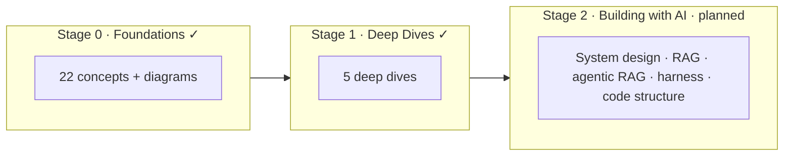

Kho kiến thức cá nhân cho mọi thứ mình đang học về Trí tuệ nhân tạo — ghi chú, tài liệu tham
khảo và các mô hình tư duy, được sắp xếp thành một lộ trình học từ nền tảng đến nâng cao.

Nội dung được viết chủ yếu bằng **tiếng Anh**, kèm bản dịch **tiếng Việt** truy cập được qua
nút chuyển ngôn ngữ ở thanh điều hướng phía trên.

## Lộ trình học

Vault được tổ chức thành một lộ trình theo giai đoạn — từ *hiểu* AI, đến *đào sâu* các chủ đề
cốt lõi, rồi đến *xây* hệ thống thật.

- **[Giai đoạn 0 — Nền tảng]()** ✓ — các khối kiến thức cốt lõi,
  cho builder kỹ thuật *dùng* AI: mô hình, prompting, context, embeddings, RAG, tool, agent,
  MCP, guardrail, security, đánh giá, observability.
- **[Giai đoạn 1 — Deep Dives]()** ✓ — đào sâu hơn các chủ đề hữu
  ích trong hệ thống thật: advanced RAG, agent patterns, prompt patterns, adaptation,
  evaluation in practice.
- **[Giai đoạn 2 — Building with AI]()** — *dự kiến* — kiến trúc
  thực hành với **C4 diagram**: AI system design, building RAG, agentic RAG, agent harness, và
  code structure.

Mới bắt đầu? Hãy vào **[Giai đoạn 0 — Nền tảng]()**.
