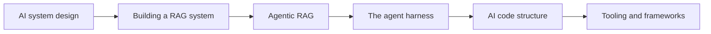

Nếu [Nền tảng]() giải thích các mảnh ghép và
[Deep Dives]() đào sâu hơn, thì **Giai đoạn 2** là về lắp ráp chúng
thành hệ thống thật — kèm sơ đồ cho phần kiến trúc.

## Lộ trình

## Trong phần này

1. [AI system design]() — hình hài chuẩn của một app AI.
2. [Building a RAG system]() — kiến trúc tham chiếu end-to-end.
3. [Agentic RAG]() — truy xuất do agent dẫn dắt, không phải pipeline cố định.
4. [The agent harness]() — vòng lặp, context, tools, memory, guardrail.
5. [AI code structure]() — cách tổ chức codebase app AI.
6. [Tooling & frameworks]() — SDK, framework, MCP, deployment.

## Yêu cầu trước

Hãy học qua [Giai đoạn 0 — Nền tảng]() và
[Giai đoạn 1 — Deep Dives]() trước — Giai đoạn 2 xây trực tiếp trên cả hai.
