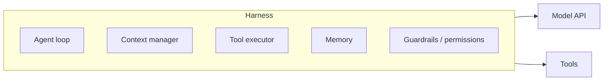
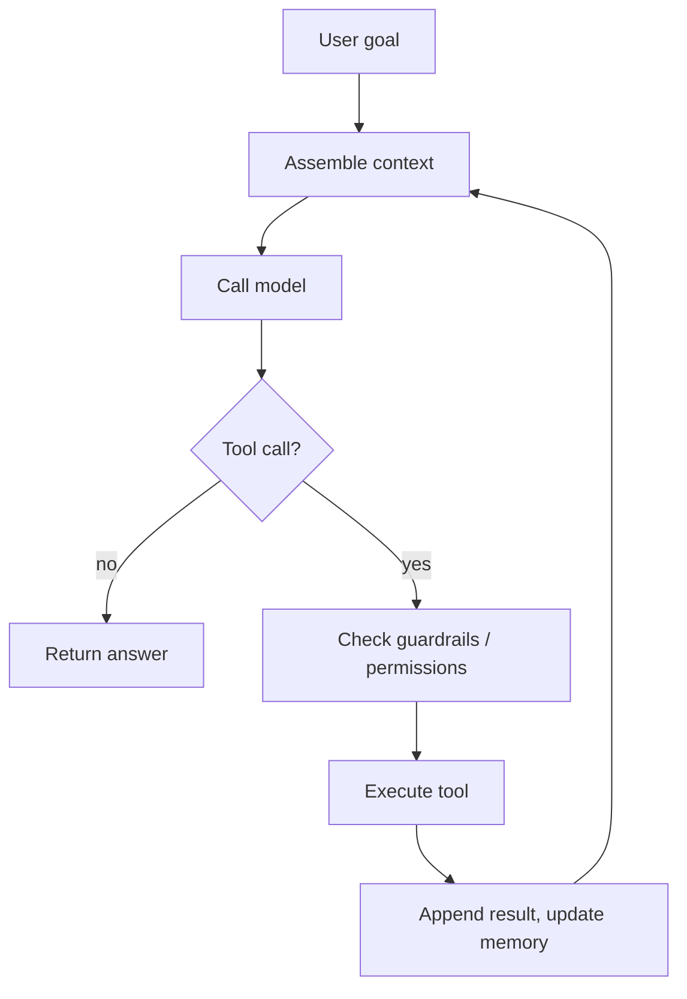

Tiếp nối [Agentic AI](). Model là động cơ; **harness** là
mọi thứ quanh nó biến một lời gọi model đơn lẻ thành một agent hoạt động. Trang này nói cách xây một cái.

## Harness sở hữu những gì

## Vòng lặp

Ở lõi, harness chạy một vòng lặp đến khi xong việc:

Mỗi lượt: lắp ráp context, gọi [model](), và nếu nó trả
về một [tool call](), thực thi tool, nối kết
quả, và lặp — đến khi model trả lời hoặc chạm điều kiện dừng.

## Những phần khó

- **Quản lý context** — [window]() là hữu hạn;
  khi vòng lặp dài ra, bạn phải tóm tắt hoặc cắt bớt kết quả tool cũ, nếu không run sẽ hỏng.
- **Thực thi tool** — validate tham số, chặn hành động rủi ro sau phê duyệt, chạy gọi song song,
  và trả lỗi dưới dạng kết quả để model phục hồi được.
- **Memory** — mang dữ kiện qua các lượt (và các phiên) mà không nhồi mọi thứ vào window.
- **Điều kiện dừng** — giới hạn số bước, phát hiện lặp, và ngân sách token/thời gian, để một
  agent bị kẹt kết thúc êm thay vì quay vòng.
- **Guardrail** — áp [kiểm tra đầu vào/đầu ra]() và
  [security]() ở *mỗi* lượt, không chỉ lượt đầu.

## Build vs buy

Bạn hiếm khi tự viết tất cả:

- **Tự viết vòng lặp** — toàn quyền; tốn công nhất.
- **Dùng framework / SDK** — vòng lặp, xử lý tool và quản lý context có sẵn.
- **Dịch vụ managed** — nhà cung cấp host vòng lặp và sandbox tool cho bạn.

Chọn cái nào là chủ đề [Tooling & frameworks](), sắp tới.
