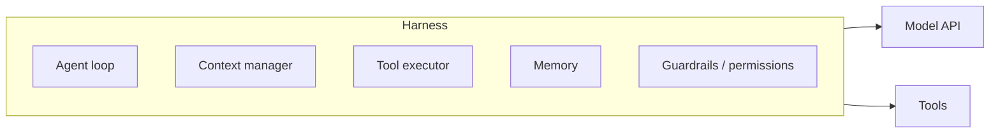
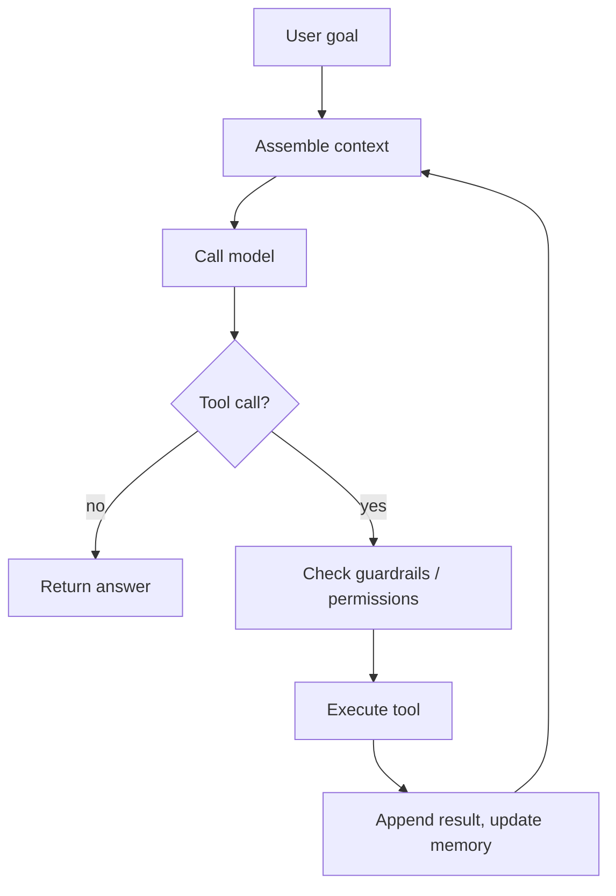

Tiếp nối [Agentic AI](). Model là động cơ; **harness** là
mọi thứ quanh nó biến một lời gọi model đơn lẻ thành một agent hoạt động. Trang này nói cách xây một cái.

## Harness sở hữu những gì

```mermaid
flowchart LR
    subgraph Harness
      Loop[Agent loop]
      CtxM[Context manager]
      ToolR[Tool executor]
      Mem[Memory]
      Guard[Guardrails / permissions]
    end
    Harness --> Model[Model API]
    Harness --> Tools[Tools]
```

## Vòng lặp

Ở lõi, harness chạy một vòng lặp đến khi xong việc:

```mermaid
flowchart TD
    In[User goal] --> Ctx[Assemble context]
    Ctx --> M[Call model]
    M --> Dec{Tool call?}
    Dec -->|no| Out[Return answer]
    Dec -->|yes| G[Check guardrails / permissions]
    G --> Ex[Execute tool]
    Ex --> Up[Append result, update memory]
    Up --> Ctx
```

Mỗi lượt: lắp ráp context, gọi [model](), và nếu nó trả
về một [tool call](), thực thi tool, nối kết
quả, và lặp — đến khi model trả lời hoặc chạm điều kiện dừng.

## Những phần khó

- **Quản lý context** — [window]() là hữu hạn;
  khi vòng lặp dài ra, bạn phải tóm tắt hoặc cắt bớt kết quả tool cũ, nếu không run sẽ hỏng.
  Điều này quan trọng nhất lúc **thử lại**: mang nguyên transcript của lần fail đi tiếp vừa phí
  window vừa neo model lại vào chính các ngõ cụt của nó. Hãy giữ bài học, trạng thái hiện tại
  của tạo tác, và tiêu chí nó phải đạt — bỏ phần còn lại.
- **Thực thi tool** — validate tham số, chặn hành động rủi ro sau phê duyệt, chạy gọi song song,
  và trả lỗi dưới dạng kết quả để model phục hồi được.
- **Memory** — mang dữ kiện qua các lượt (và các phiên) mà không nhồi mọi thứ vào window.
- **Điều kiện dừng** — giới hạn số bước, phát hiện lặp, và ngân sách token/thời gian, để một
  agent bị kẹt kết thúc êm thay vì quay vòng. Một bộ ngoài đời thật: *dừng sau 20 bước hoặc
  100k token; dừng nếu cùng một tool bị gọi với cùng tham số hai lần liên tiếp; khi dừng, tóm
  tắt tiến độ thay vì fail trong im lặng.*
- **Guardrail** — áp [kiểm tra đầu vào/đầu ra]() và
  [security]() ở *mỗi* lượt, không chỉ lượt đầu.

Một harness chạy vòng lặp của một agent. Còn thiết kế chính các vòng lặp — validator, closed
loop, orchestration nhiều worker — là trang kế tiếp:
[Loop engineering]().

## Skills — quy trình đóng gói

Ngoài tool, các harness trưởng thành còn hỗ trợ **skills**: chỉ dẫn đóng gói cho một loại tác
vụ cụ thể (checklist deploy, quy trình review, format báo cáo) được nạp vào context khi tác vụ
đó xuất hiện. Tool cho agent *năng lực*; skill cho nó *quy trình* — khác biệt giữa việc đưa ai
đó cái terminal và đưa họ cuốn runbook.

## Build vs buy

Bạn hiếm khi tự viết tất cả:

- **Tự viết vòng lặp** — toàn quyền; tốn công nhất.
- **Dùng framework / SDK** — vòng lặp, xử lý tool và quản lý context có sẵn.
- **Dịch vụ managed** — nhà cung cấp host vòng lặp và sandbox tool cho bạn.

Chọn cái nào là chủ đề [Tooling & frameworks](), sắp tới.

## Nguồn

- [Anthropic — Effective harnesses for long-running agents](https://www.anthropic.com/engineering/effective-harnesses-for-long-running-agents)
- [Anthropic — Building effective agents](https://www.anthropic.com/research/building-effective-agents)
