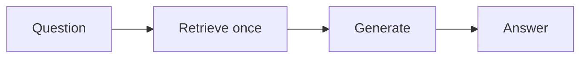
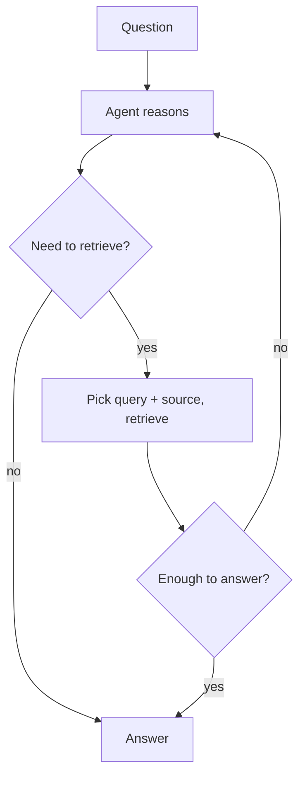

Tiếp nối [Agentic AI]() và
[Types of RAG](). Trong **standard RAG**, pipeline là
cố định — luôn truy xuất một lần rồi sinh câu trả lời. **Agentic RAG** giao quyền đó cho một
[agent](): nó tự quyết *có truy xuất không*, *truy gì*, và
*bao nhiêu lần*, dùng truy xuất như một tool.

## Standard vs agentic

Standard RAG (trên) là một lượt cố định. Agentic RAG (dưới) là một vòng lặp do agent điều khiển:

## Agent tự quyết những gì

- **Có truy xuất không** — có câu hỏi không cần.
- **Truy gì** — thường là viết lại câu hỏi của người dùng, hoặc nhiều truy vấn con.
- **Nguồn nào** — các vector store khác nhau, web search, database, API.
- **Bao nhiêu vòng** — truy xuất, đọc, rồi truy tiếp cho một dữ kiện bổ sung (multi-hop).
- **Context đã đủ chưa** — truy lại hoặc hỏi làm rõ nếu chưa.

Truy xuất trở thành một [tool]() mà agent gọi,
không phải bước đầu tiên cố định.

## Khi nào nên dùng

- ✅ **Câu hỏi multi-hop** — câu trả lời cần một dữ kiện đòi hỏi tra lần hai.
- ✅ **Nhiều nguồn** — agent định tuyến tới đúng nguồn.
- ✅ **Truy vấn mơ hồ** — agent có thể viết lại, hoặc hỏi, trước khi truy xuất.
- ❌ **Q&A đơn giản trên một corpus** — [standard RAG]()
  nhanh hơn, rẻ hơn, dễ đoán hơn.

## Đánh đổi

Mạnh hơn, nhưng nhiều độ trễ, chi phí và bộ phận chuyển động hơn — và khó làm cho đáng tin hơn
(agent có thể lặp hoặc truy xuất kém). Thêm [guardrail](),
giới hạn số bước, và [đánh giá]() — đặc biệt là
các kiểm tra chất lượng truy xuất trong [Advanced RAG]().
Chỉ dùng agentic RAG khi standard hoặc advanced RAG thực sự không đủ.
