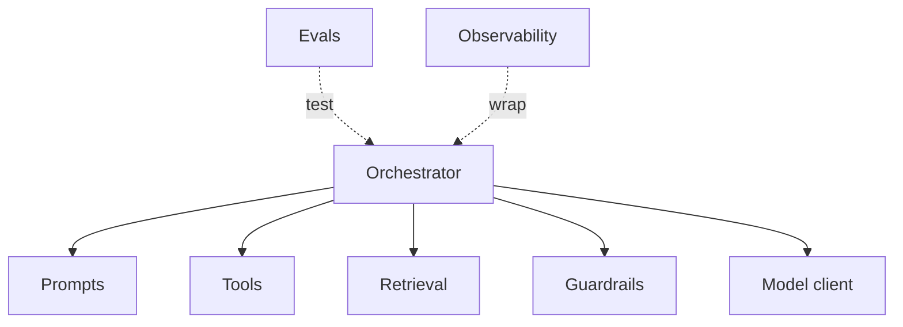

Một app AI có nhiều bộ phận chuyển động hơn service thường — prompts, tools, retrieval,
guardrails, evals. Nhồi hết vào một file khiến chúng không thể test hay thay đổi. Một chút cấu
trúc giữ mỗi mối quan tâm tách biệt và thay được.

## Bố cục gợi ý

```text
app/
├── prompts/          # prompt template có version (không phải string inline)
├── tools/            # định nghĩa + handler của tool, mỗi tool một cái
├── retrieval/        # ingestion + query: chunk, embed, vector store
├── orchestrator/     # harness: lắp ráp context, chạy vòng lặp
├── guardrails/       # kiểm tra đầu vào/đầu ra, che PII
├── evals/            # bộ eval + runner (chạy trong CI)
├── observability/    # tracing, logging, metrics
├── clients/          # client gọi model API
└── config/           # settings, model id — không để secret trong code
```

## Các phần phụ thuộc nhau ra sao



## Nguyên tắc

- **Prompt là file, không phải string literal** — đánh version, diff, test được (xem
  [Prompt engineering]()).
- **Một tool = một module** — một định nghĩa + một handler test được độc lập (xem
  [Tool & function calling]()).
- **Tách riêng retrieval** — [pipeline ingest và query]()
  là lớp riêng, không trộn vào orchestrator.
- **Orchestrator mỏng** — [harness]() chỉ nối các phần
  lại; giữ logic ở trong các phần.
- **Evals là first-class** — một [bộ eval]()
  là test suite của bạn; chạy trong CI mỗi khi đổi prompt hoặc model.
- **Config và secret ra khỏi code** — model id và settings ở config; secret ở môi trường, không
  bao giờ trong prompt hay repo.

## Vì sao đáng làm

Khi chất lượng retrieval tụt, bạn đổi model, hay một prompt bị hồi quy, bạn chỉ sửa *một* chỗ —
và evals cho biết có được hay không, thay vì lục trong một khối monolith.
