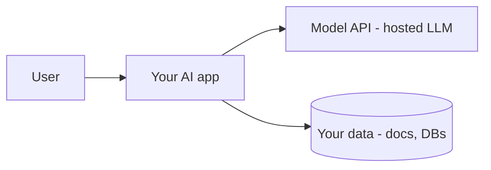
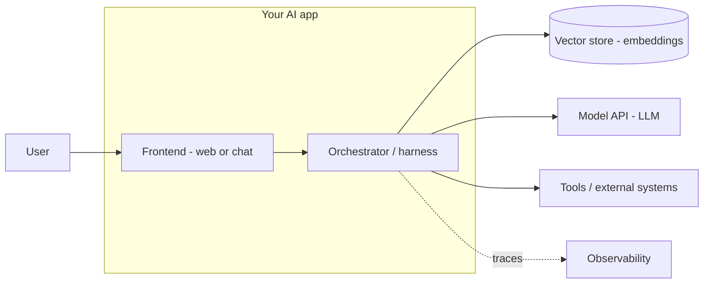

Xây một tính năng AI phần lớn là công việc *hệ thống* — model chỉ là một component trong nhiều
thứ. Trang này cho bạn hình hài chuẩn để xây quanh đó.

## Bức tranh tổng

Người dùng nói chuyện với app của bạn; app nói chuyện với một model được host và với dữ liệu của
bạn. Bạn sở hữu mọi thứ trừ bản thân model.

## Các component chuẩn

**Orchestrator (harness)** là "bộ não" bạn xây: nó lắp ráp prompt, quản lý
[context window](), chạy
[agent loop](), gọi
[tool](), và áp
[guardrail]().

## Mỗi khái niệm nền tảng nằm ở đâu

| Khái niệm | Nằm ở |
| ----------- | ------- |
| Prompting, context | Orchestrator |
| Embeddings, RAG | Vector store + retrieval |
| Tools, agents | Vòng lặp orchestrator + tools |
| Guardrails, security | Quanh đầu vào và đầu ra |
| Evaluation, observability | Xuyên suốt, bao quanh mọi thứ |

## Nguyên tắc thiết kế

- Model là **stateless** — bạn sở hữu state và context.
- Đặt **tính xác định trong code**, phần phán đoán ở model.
- **Neo** bằng dữ liệu, **ràng buộc** bằng schema, **kiểm soát** các hành động rủi ro.
- **Đo** mọi thứ — eval offline, trace online.
