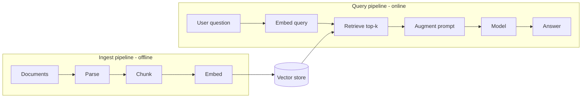

Tiếp nối [RAG ở phần Nền tảng](). Một hệ RAG thật là **hai
pipeline** gặp nhau tại vector store: một chạy *offline* để lập chỉ mục dữ liệu, một chạy
*online* cho mỗi câu hỏi.

## Hai pipeline

## Ingest pipeline (offline)

Chạy khi dữ liệu thay đổi, không phải mỗi request:

1. **Parse** tài liệu (PDF, HTML, Word) thành text sạch.
2. **Chunk** thành các đoạn có kích thước hợp cho truy xuất.
3. **Embed** mỗi chunk bằng [embedding model]().
4. **Store** các vector (+ metadata nguồn) vào vector store.

Chạy lại khi tài liệu đổi — không cần huấn luyện lại model.

## Query pipeline (online)

Chạy cho mỗi câu hỏi:

1. **Embed** câu hỏi bằng *cùng* embedding model.
2. **Retrieve** top-k chunk tương đồng nhất từ vector store.
3. **Augment** prompt với các chunk đó làm context.
4. **Generate** câu trả lời — lý tưởng là kèm trích dẫn về nguồn.

## Các component bạn xây

| Component | Nhiệm vụ |
| ----------- | ---------- |
| Ingestion job | Parse → chunk → embed → store (định kỳ hoặc khi đổi) |
| Embedding model | Cùng một model cho tài liệu và truy vấn |
| Vector store | Lập chỉ mục + similarity search (pgvector, FAISS, …) |
| Retriever | Lấy top-k (thêm hybrid + re-ranking khi cần) |
| Orchestrator | Dựng prompt đã augment, gọi model, định dạng trích dẫn |

## Làm cho đúng

Đa số vấn đề chất lượng RAG là vấn đề **truy xuất**, không phải model — chunking, hybrid search,
re-ranking là các đòn bẩy. Xem [Advanced RAG](), và
đánh giá truy xuất tách biệt với sinh câu trả lời (xem
[Evaluation in practice]()).
