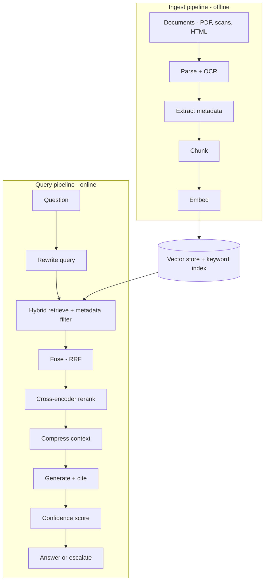

Tiếp nối [RAG ở Nền tảng](). Một hệ RAG production **nhiều hơn rất
nhiều** so với *Documents → Embeddings → LLM*. Nó là **hai pipeline** gặp nhau ở store — một
pipeline ingest *offline* và một pipeline query *online* — mỗi cái là một chuỗi stage. Luận
điểm cần nhớ:

> Chất lượng câu trả lời phụ thuộc **retrieval** nhiều hơn LLM rất nhiều. Model là động cơ suy
> luận; retrieval mới là nơi engineering thực sự diễn ra.

```mermaid
flowchart TB
    subgraph Ingest[Ingest pipeline - offline]
      D[Documents - PDF, scans, HTML] --> P[Parse + OCR] --> M[Extract metadata]
      M --> C[Chunk] --> E1[Embed]
    end
    E1 --> V[(Vector store + keyword index)]
    subgraph Query[Query pipeline - online]
      Q[Question] --> QR[Rewrite query] --> R[Hybrid retrieve + metadata filter]
      R --> F[Fuse - RRF] --> RR[Cross-encoder rerank] --> CC[Compress context]
      CC --> G[Generate + cite] --> CF[Confidence score] --> A[Answer or escalate]
    end
    V --> R
```

## Ingest pipeline (offline)

Chạy khi dữ liệu thay đổi, không phải mỗi request — không cần huấn luyện lại model.

- **Parse + OCR** — biến tài liệu thật lộn xộn thành text sạch. *Vì sao:* parse sai thì mọi
  thứ phía sau là rác. *Ví dụ:* một PDF scan hóa đơn → OCR rút text và một parser hiểu layout
  giữ nguyên bảng, để `Total: $4,012` không bị tách khỏi nhãn. Xử lý PDF, Word, HTML, ảnh,
  bảng, code block một cách riêng biệt.
- **Extract metadata** — gắn `{source, page, section, date, …}` vào mỗi chunk. *Vì sao:* nó
  nuôi [filtering]() và citations — không có nó
  thì không giới hạn được "chỉ tài liệu 2026, gói Pro" và không trích được nguồn. *Ví dụ:*
  `{source: handbook.pdf, page: 12, section: "Refunds", date: 2026}`.
- **Chunk** — chia thành các đoạn truy xuất được. *Vì sao:* kích thước chunk là một trong ba
  đòn bẩy chất lượng lớn nhất. *Ví dụ:* recursive chunking cắt theo heading rồi paragraph, chồng
  lấn ~15% để một ý không bị cắt giữa câu. Xem
  [chunking strategies]().
- **Embed** — vector hóa mỗi chunk bằng [embedding model](). Dùng
  **cùng một model** cho tài liệu và truy vấn.
- **Store** — index vector (+ metadata) trong một
  [vector store]() và dựng thêm một keyword index
  bên cạnh cho hybrid search.

## Query pipeline (online)

Chạy mỗi câu hỏi — chuỗi này là nơi phần lớn chất lượng được ăn hoặc thua.

- **Rewrite query** — lời của user thường không phải truy vấn tìm kiếm tốt nhất. *Vì sao:*
  query tốt hơn → recall tốt hơn. *Ví dụ:* *"gửi trả lại mất bao lâu?"* → viết lại thành
  *"chính sách return / refund window"*; hoặc mở rộng thành vài cách diễn đạt. Xem
  [query transformation]().
- **Hybrid retrieve + filter** — chạy **vector** (nghĩa) và **BM25** (term chính xác) cùng
  nhau, giới hạn bằng metadata. *Vì sao:* mỗi bên bù điểm mù cho bên kia. *Ví dụ:* *"error
  E-4012"* — vector tìm tài liệu troubleshooting diễn đạt khác, BM25 tìm mã chính xác; filter
  metadata giới hạn ở đúng phiên bản sản phẩm hiện tại.
- **Fuse (RRF)** — gộp hai danh sách xếp hạng bằng Reciprocal Rank Fusion thành một thứ tự.
  *Vì sao:* kết hợp dense và sparse công bằng mà không cần chỉnh trọng số tay.
- **Cross-encoder rerank** — chấm lại top ~50 bằng một model đọc query và đoạn văn *cùng lúc*,
  giữ vài cái tốt nhất. *Vì sao:* chính xác hơn nhiều so với tương đồng embedding, để đoạn tốt
  nhất xếp hạng nhất. *Ví dụ:* một đoạn chỉ nhắc keyword tụt xuống dưới đoạn thực sự trả lời
  câu hỏi.
- **Compress context** — cắt mỗi chunk còn sống còn đúng các câu liên quan. *Vì sao:* giảm
  token và tăng faithfulness bằng cách bỏ phần gây nhiễu. *Ví dụ:* một chunk 1.200 token → 2
  câu nêu refund window. Xem [context compression]().
- **Generate + cite** — dựng prompt tăng cường, gọi model, và trích chunk mà mỗi khẳng định
  đến từ đó. *Vì sao:* citations làm câu trả lời kiểm chứng được và là thuốc giải cho
  hallucination. *Ví dụ:* *"Hoàn tiền trong vòng 30 ngày [handbook.pdf p.12]."*
- **Confidence score + escalate** — chấm mức độ có căn cứ của câu trả lời. *Vì sao:* cần biết
  khi nào *từ chối* thay vì đoán. *Ví dụ:* điểm retrieval thấp hoặc answer không chunk nào hỗ
  trợ → trả *"không đủ tự tin — chuyển cho con người"* thay vì một hallucination trôi chảy. Nối
  với [guardrails]() và
  [responsible AI]().

## Các thành phần bạn xây

| Thành phần | Việc |
| ----------- | ----- |
| Ingestion job | Parse/OCR → extract metadata → chunk → embed → store (theo lịch hoặc khi đổi) |
| Embedding model | Cùng một model cho tài liệu và truy vấn |
| Vector + keyword store | Similarity search + BM25 ([pgvector]()) |
| Retriever | Query rewrite → hybrid retrieve → filter → RRF → rerank → compress |
| Orchestrator | Dựng prompt, gọi model, format citations, chấm confidence |

## Làm sao cho đúng

Phần lớn lỗi chất lượng RAG là lỗi **retrieval**, không phải lỗi model. Thêm stage theo thứ tự
lợi ích — hybrid search và re-ranking trước, rồi compression và confidence — và **đánh giá
retrieval và generation tách biệt** (xem
[Evaluation in practice]()). Đừng dựng cả
chuỗi ngay ngày đầu; thêm mỗi stage khi một lỗi thật đòi hỏi. Ở quy mô, pipeline này còn cần
caching, queue và reliability — xem
[Scaling to production]().

## Nguồn

- Lewis et al., *Retrieval-Augmented Generation for Knowledge-Intensive NLP Tasks* (2020) — [arXiv:2005.11401](https://arxiv.org/abs/2005.11401)
- Es et al., *RAGAS: Automated Evaluation of Retrieval Augmented Generation* (2023) — [arXiv:2309.15217](https://arxiv.org/abs/2309.15217)
- [Google Cloud — Document AI (OCR & parsing)](https://cloud.google.com/document-ai/docs/overview)
- Jiang et al., *LLMLingua: Compressing Prompts for Accelerated Inference* (2023) — [arXiv:2310.06839](https://arxiv.org/abs/2310.06839)
