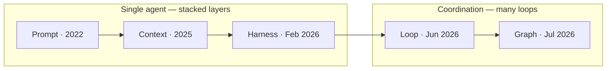
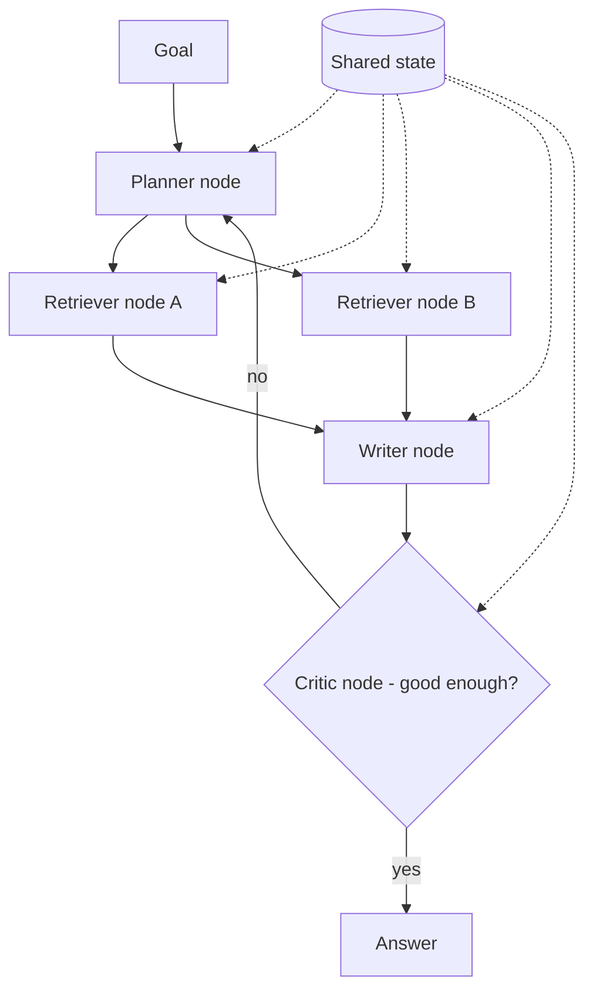

## Mục tiêu

Hiểu cho ra cơn bùng nổ thuật ngữ: **prompt → context → harness → loop → graph engineering**,
năm cái tên trong khoảng năm năm. Trang này xếp chúng lên một dòng thời gian, cho mỗi thời kỳ
một ví dụ cụ thể, và chỉ ra đường ranh cấu trúc chia tách chúng — để cái tên "-engineering"
tiếp theo rơi vào đúng một mô hình tư duy thay vì góp thêm vào mớ hỗn độn.

## Một phân biệt sắp xếp cả năm

Mỗi discipline ra đời vì cái trước đụng tường. Nhưng chúng chia gọn thành hai nhóm:

- **Prompt, context, harness** là ba **lớp của cùng một bài toán single-agent** — làm sao một
  model nhận đúng chỉ dẫn, đúng tri thức, và đúng rào chắn.
- **Loop và graph** là chuyện **coordination** — công việc lặp lại thế nào và nhiều agent chia
  nhau ra sao. Graph chỉ là cái mà một loop trở thành khi một loop không đủ.

Đó là toàn bộ tấm bản đồ. Phần còn lại của trang là mỗi lớp thêm được gì.

## Mỗi thời kỳ thêm được gì

Đọc như một cái thang — mỗi bậc giải một lỗi mà bậc dưới không giải nổi:

| Thời kỳ | Discipline | Thêm được gì | Lỗi nó sửa |
| ------ | ------ | ------ | ------ |
| 2022 | [Prompt]() | Định hình một lần trao đổi | — |
| 2025 | [Context]() | Mọi thứ model biết ngoài prompt | Prompt hoàn hảo cũng không thêm được tri thức model chưa có |
| 02/2026 | [Harness]() | Ràng buộc và cổng chặn quanh agent | Prompt tốt không ngăn agent `rm -rf` cả repo |
| 06/2026 | [Loop]() | Chu trình plan–execute–verify và định nghĩa "xong" | Một lần gọi không tự kiểm và sửa việc của chính nó |
| 07/2026 | Graph | Nhiều loop nối qua node, edge, shared state | Một loop tuần tự nghẽn với việc cần vai chuyên biệt, chạy song song |

### Prompt engineering — định hình một lần trao đổi

*"Tóm tắt hợp đồng này thành năm gạch đầu dòng; chỉ dùng đúng văn bản được cung cấp."* Bạn
đang tinh chỉnh chỉ dẫn đơn lẻ. Đây là toàn bộ cuộc chơi khi model đã sẵn biết cái nó cần và
tác vụ gói trong một lượt.

**Tường:** model không trả lời được về tài liệu *của bạn* — không prompt nào chứa tri thức
model chưa từng được cấp.

### Context engineering — quản lý những gì model biết

Bạn lắp mọi thứ quanh prompt: tài liệu truy xuất ([RAG]()),
[memory](), định nghĩa tool, lịch sử phiên — và
quan trọng không kém, bỏ gì ra ngoài để [context window]()
gọn nhẹ. Ví dụ: một support bot trả lời về gói dịch vụ của *khách này* vì context engineering
đã đặt bản ghi tài khoản và chính sách liên quan vào cửa sổ.

**Tường:** giờ agent có thể *hành động* (sửa file, gọi API) — và chẳng gì ngăn nó hành động
sai ở quy mô lớn.

### Harness engineering — ràng buộc và cổng chặn

[Harness]() là giàn giáo giữ agent trong khuôn: quyền,
sandbox, cổng duyệt, allow-list tool. Ví dụ: một coding agent được sửa file thoải mái nhưng
một gate chặn lệnh xóa shell và bắt buộc con người duyệt trước khi merge. Prompt tốt là một
*lời đề nghị*; harness là một điểm dừng ở tầng *kiến trúc* — agent không vượt qua được vạch
kẻ dù nó có quyết định vậy.

**Tường:** một lượt hiếm khi đúng ngay; chất lượng cần lặp-và-kiểm.

### Loop engineering — chu trình lặp

Thiết kế [vòng plan–execute–verify](): cái gì kích
hoạt mỗi bước, ai validate kết quả, thế nào là xong, và cái gì dừng nó. Ví dụ: autofixer
SonarQube — fixer vá, reviewer chấm, feedback quay lại, chặn bởi một hard limit.

**Tường:** một loop chạy tuần tự nghẽn khi công việc cần các chuyên gia khác nhau hoặc chạy
song song.

### Graph engineering — nối nhiều loop lại

Khi một loop không đủ, bạn mô hình hóa công việc thành một **graph**: **node** (agent hoặc
bước), **edge** (cái gì chảy vào cái gì, gồm cả nhánh có điều kiện), và **shared state** (cái
mọi node đọc và ghi được). Supervisor không còn tự làm việc — nó định tuyến.

Ví dụ: một trợ lý nghiên cứu — planner tách câu hỏi, hai retriever node chạy **song song**
trên các nguồn khác nhau, một writer gộp lại, và một critic node quay lại qua edge có điều
kiện đến khi câu trả lời đạt. Mỗi node là một loop nhỏ của riêng nó; graph là phần đấu dây.

Đây là chỗ [multi-agent patterns]() gặp bậc
"orchestration" của [loop engineering](): graph
engineering là *cấu trúc* mà orchestration chạy trên đó. Đáng chú ý, ý tưởng này không mới —
các framework như LangGraph đã mô hình node/edge/state trước khi thuật ngữ "graph engineering"
tồn tại, đó là dấu hiệu cho thấy một phần chuyện này là **từ vựng mới cho kiến trúc đã có**.

## Lớp thật vs tên gọi đổi mới — một lưu ý

Trong các chuyển dịch này, có cái là kiến trúc mới thật, có cái phần lớn là đặt tên. Harness →
loop → graph xuất hiện trong khoảng năm tháng — một nhịp nói lên về marketing nhiều ngang với
về engineering. Cách đọc hữu ích:

- **Thực sự khác biệt:** prompt, context, harness *chồng lên nhau* — một hệ thống thật làm cả
  ba cùng lúc, chúng không phải lựa chọn thay thế.
- **Rất gần nhau:** loop và graph là cùng một ý coordination ở quy mô khác nhau — một chu
  trình vs nhiều chu trình đấu dây với nhau.

Nên khi cái tên "-engineering" tiếp theo xuất hiện, hãy hỏi: *đây là một lớp mới của bài toán
single-agent, một quy mô coordination mới, hay một từ mới cho thứ framework đã làm rồi?* Câu
hỏi đó mới là điều đọng lại lâu dài; nhãn thì sẽ cứ đổi.

## Chúng chồng lên nhau thế nào trong một hệ thống thật

Chúng không phải một thực đơn — một agent production dùng tất cả cùng lúc:

| Lớp | Trong một coding agent |
| ------ | ------ |
| Prompt | Tác vụ bạn gõ |
| Context | File, lịch sử, docs nó được cấp |
| Harness | Quyền, sandbox, cổng duyệt của nó |
| Loop | Sửa → chạy test → sửa, đến khi xanh |
| Graph | Một planner giao cho các sub-agent coder + reviewer + tester |

## Nguồn

- Osmani, *Loop Engineering* (2026) — [addyo.substack.com](https://addyo.substack.com/p/loop-engineering)
- [Anthropic — Effective context engineering for AI agents](https://www.anthropic.com/engineering/effective-context-engineering-for-ai-agents)
- [Anthropic — Effective harnesses for long-running agents](https://www.anthropic.com/engineering/effective-harnesses-for-long-running-agents)
- [LangGraph — Low-level concepts (nodes, edges, state)](https://langchain-ai.github.io/langgraph/concepts/low_level/)
- Hong et al., *MetaGPT: Meta Programming for Multi-Agent Collaborative Framework* (2023) — [arXiv:2308.00352](https://arxiv.org/abs/2308.00352)
