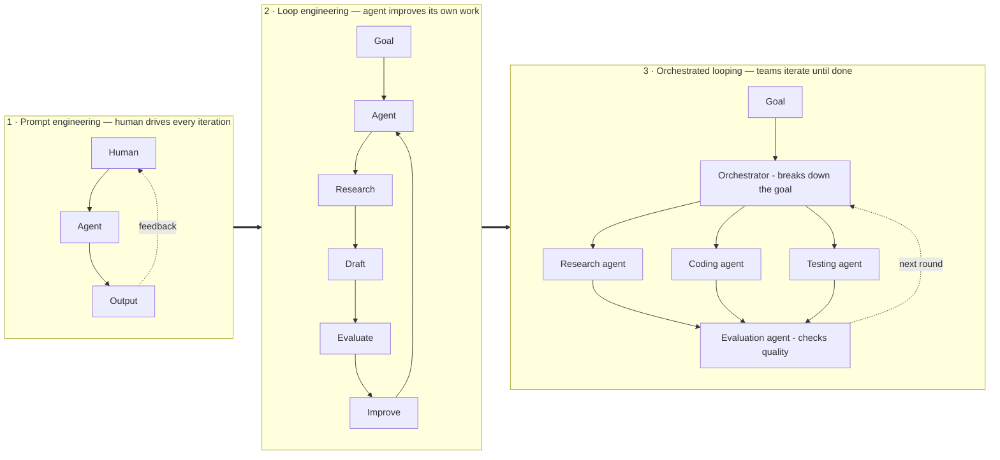
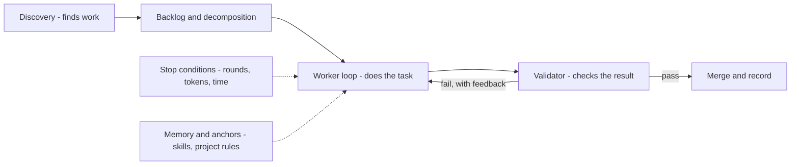
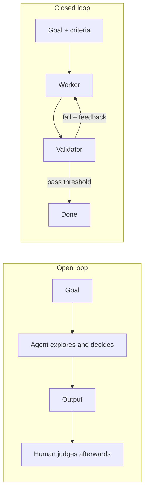
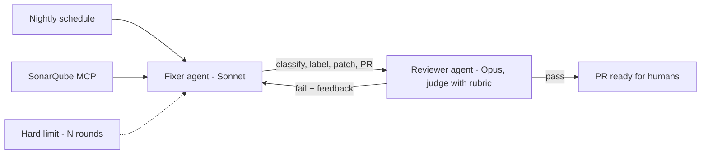

## Mục tiêu

Trả lời đúng chuỗi câu hỏi một builder sẽ hỏi về loop: loop engineering *là gì*, cấu tạo gồm
những phần nào, có bao nhiêu loại, vì sao cần — và có bắt buộc code trên SDK không, hay dùng
được luôn [Claude Code / Codex]() có sẵn?

## Là gì

**Loop engineering là thiết kế chính sự lặp lại, thay vì tự mình ngồi lặp.**
[Prompt engineering]() định hình *một lần gọi
model*; [harness]() chạy *vòng lặp của một agent*;
loop engineering thiết kế **hệ thống các vòng lặp**: cái gì lặp, ai kiểm kết quả, thế nào là
"xong", và cái gì dừng nó lại. Gói trong một câu: bạn thôi làm người prompt agent — bạn xây
cái thứ đi prompt agent.

## Bậc thang trưởng thành

Ngành đi tới đây thế nào — mỗi thế hệ sửa đúng cái hỏng của thế hệ trước:

| Năm | Loop | Bài học nó dạy |
| ------ | ------ | ------ |
| 2022 | **ReAct** — reason → act → observe, một model, một vòng | Lặp thắng trả lời một phát |
| 2023 | **AutoGPT** — vòng lặp theo đuổi mục tiêu | Nổi tiếng vì quay vô tận → loop cần **điều kiện dừng** |
| 2025 | **Ralph loop** — cùng một prompt chạy lại trên các anchor file cố định | Anchor bền giữ các run dài mạch lạc |
| Đầu 2026 | **Productised loop** — validator quyết định khi nào việc xong | "Xong" phải được *kiểm*, không phải tự tuyên bố |
| Giữa 2026 | **Orchestration** — supervisor lập lịch, điều phối các worker loop | Một vòng lặp không scale; đội các vòng lặp thì có |

## Cấu tạo — các thành phần

Một loop production có sáu phần. Worker là phần *ít* thú vị nhất:

- **Discovery / automations** — tự tìm việc không cần con người kích hoạt: lịch chạy,
  webhook, scanner.
- **Decomposition** — orchestrator chia mục tiêu thành các task worker nhận được.
- **Worker** — một agent với [tools]() và
  [MCP connector](); worker chạy song song thì cần **git
  worktree** để không ghi đè lên nhau.
- **Validator** — một phán xét thứ hai ([LLM-as-judge](),
  bộ test, hoặc cả hai) quyết định đạt/không đạt — không bao giờ để worker tự chấm mình.
- **Điều kiện dừng** — giới hạn vòng, ngân sách token, phát hiện lặp: bài học AutoGPT, thừa
  kế từ [harness]().
- **Memory & anchors** — [skills](), luật dự án, và
  [agent memory]() để mỗi vòng xây trên vòng trước
  thay vì khám phá lại.

## Các loại — ba trục

Mọi loop bạn gặp là một điểm trên ba trục độc lập:

| Trục | Lựa chọn | Đánh đổi |
| ------ | ------ | ------ |
| **Kiến trúc** | **Open loop** — agent tự do khám phá, tự quyết bước sau · **Closed loop** — mục tiêu, tiêu chí, ngưỡng định trước | Open hợp bài chưa rõ hướng nhưng đốt token và khó đoán; closed rẻ hơn, lặp lại được, cải thiện dần — so sánh đầy đủ ở [mục kế tiếp](#open-vs-closed-loop) |
| **Giám sát** | **Human in the loop** — duyệt từng bước · **on the loop** — theo dõi, can thiệp khi bất thường · **out of the loop** — chỉ xem kết quả | Đúng cái thang placement của [responsible-ai](), áp cho loop: bạn tốt nghiệp từ ngồi canh một loop lên thiết kế loop để trông các loop khác |
| **Topology** | **Single loop** — một worker · **Orchestrated** — supervisor + các worker chuyên biệt | Single đơn giản và thường là đủ; orchestrate khi task song song hóa được hoặc cần tách vai người-làm và người-kiểm |

## Open vs closed loop

Tên gọi mượn từ lý thuyết điều khiển: vòng lặp **closed** đưa output ngược lại và hiệu chỉnh
theo một chuẩn tham chiếu; vòng lặp **open** chạy mà không có đường phản hồi đó. Với agent:

- **Open loop** — agent nhận mục tiêu và sự tự do: nó khám phá, suy luận, tự quyết các bước
  tiếp theo. Không có tiêu chí thành công định trước; run kết thúc khi agent tự tuyên bố xong
  hoặc cạn ngân sách, và *con người* chấm output sau đó.
- **Closed loop** — mục tiêu đi kèm **tiêu chí thành công và validator tường minh**, định
  nghĩa *trước* khi chạy. Mỗi vòng lặp được đo theo tiêu chí; lỗi được đưa ngược về vòng sau;
  "xong" nghĩa là *vượt ngưỡng*, không phải "agent thấy đủ rồi".

| Câu hỏi | Open loop | Closed loop |
| ------ | ------ | ------ |
| Ai quyết bước kế tiếp? | Model, ngay lúc chạy | Quy trình, thiết kế từ trước |
| "Xong" nghĩa là gì? | Agent tự tuyên bố, hoặc cạn ngân sách | Validator vượt ngưỡng |
| Chi phí mỗi run | Khó đoán | Có chặn trên (số vòng × ngân sách) |
| Kết quả giữa các run | Dao động | Lặp lại được |
| Cải thiện được không? | Khó — không có gì được đo | Run sau hơn run trước — mỗi run đều có điểm |
| Rủi ro chính | Đốt token, trôi hướng, chất lượng may rủi | Rubric sai thì bị cưỡng chế với tốc độ máy; giải pháp ngoài khung bị bỏ lỡ |

**Chọn open khi** chính bài toán còn chưa được khám phá: bạn chưa biết "tốt" trông thế nào,
việc là spike một lần ("tìm hiểu vì sao đám test này flaky", "vẽ bản đồ codebase legacy
này"), và con người sẽ trực tiếp đọc output. Khám phá là thứ duy nhất closed loop *không* làm
được — vì tiêu chí của nó phải tồn tại sẵn rồi.

**Chọn closed khi** tác vụ lặp lại, chạy không người canh (CI, schedule), tiêu tiền thật,
hoặc output ship ra mà không ai xem từng bước. Production mặc định closed chính vì các lý do
đó.

Hai loại không phải đối thủ — chúng là **hai giai đoạn của cùng một vòng đời**: chạy open vài
lần để *khám phá ra* tiêu chí, rồi đóng băng tiêu chí đó vào validator và đóng vòng lặp lại.
Cái autofixer bên dưới đi đúng con đường này: những lần fix SonarQube đầu tiên là khám phá,
review tay; khi rubric review ổn định, nó trở thành rubric của reviewer agent.

> Open để khám phá, closed để vận hành — tác vụ nào lặp lại đủ nhiều thì xứng đáng được đóng.

## Vì sao cần

- **Gọi một phát chạm trần** — chất lượng đến từ lặp-và-kiểm, và làm tay thì *bạn* thành nút
  cổ chai (đúng panel human-in-the-loop trong hình).
- **Niềm tin đòi validator** — output agent không ai review thì không ship được; loop có
  người kiểm biến "nghe hợp lý" thành "đã kiểm chứng".
- **Kiểm soát chi phí đòi độ đóng** — khám phá mở là chi tiêu khó đoán; closed loop với
  ngưỡng làm chi phí và chất lượng *đo được theo từng run*, nên run sau cải thiện được run
  trước.

## SDK, hay dùng luôn Claude Code / Codex?

Câu trả lời thật thà: **bắt đầu bằng công cụ có sẵn — bạn đang sở hữu sẵn một loop chuẩn
production.** Claude Code và Codex *chính là* sản phẩm loop: harness, tools, skills, MCP,
điều kiện dừng có đủ. Có một cái thang, và phải leo từng bậc xứng đáng:

1. **Dùng tool tương tác** — bạn là orchestrator. Đủ cho việc hằng ngày.
2. **Script hóa tool** — chạy headless trong CI theo lịch với prompt cố định, skills và MCP
   server. Đây đã *là* loop engineering — không cần SDK, và phủ được đa số automation closed
   loop (triage hằng đêm, quét sửa lint, cập nhật docs).
3. **Code trên SDK** ([Agent SDK, LangGraph, Microsoft Agent Framework]())
   chỉ khi loop cần thứ tool không cho được: **topology tùy biến** (một fixer và một reviewer
   khác model nói chuyện với nhau), **logic validator và ngưỡng của riêng bạn**, hoặc loop
   *chính là sản phẩm* cần UI, state và versioning riêng.

Quy tắc nhanh: loop của bạn là *một worker + một cái lịch* → script tool đang có. Là *nhiều
vai thương lượng với nhau* → lúc đó SDK mới xứng độ phức tạp của nó.

## Case study — autofixer cho static analysis

Một closed loop thật mình xây khi các đợt scan bảo mật (SonarQube) dồn issue nhỏ nhanh hơn
tốc độ người dọn:

Một **fixer** (Sonnet) kéo issue qua SonarQube MCP server, phân loại và gắn label, vá những
cái an toàn, mở PR. Một **reviewer** (Opus) chấm bản vá theo rubric; không đạt thì trả lý do
về cho fixer — tối đa N vòng (hard limit), hết thì dừng chứ không quay tiếp. Cả hệ chạy theo
lịch trong GitHub Actions, orchestrate bằng một agent framework cộng skills (guidelines,
incremental-implementation, sonar-guardrails). Đủ mặt cả ba trục: loop **closed**, human
**on** the loop (họ review PR, không canh từng bước), topology **orchestrated** — và nó chỉ
cần SDK vì hai model khác nhau phải thương lượng; riêng nửa discovery hoàn toàn có thể là một
coding agent chạy script.

## Điểm mạnh & hạn chế

- **Điểm mạnh** — throughput không còn nút cổ chai con người; validator làm chất lượng thành
  thứ *được cưỡng chế*, không phải được hy vọng; closed loop cho trần chi phí và tiến bộ qua
  từng run; tách người-làm/người-kiểm bắt được cái tự-review không thấy.
- **Hạn chế** — validator có thể bị lừa hoặc sai (thiên lệch judge — hiệu chỉnh với nhãn con
  người); loop khuếch đại một prompt hay rubric tồi với tốc độ máy; orchestration nhân chi
  phí và điểm hỏng — đa số task vẫn xứng với một worker và một cái lịch, không phải một hạm
  đội.

Khi orchestration *thực sự* xứng đáng, cấu trúc mà các loop phối hợp chạy trên đó là một graph
— xem [From prompts to graphs]() để thấy
loop engineering nằm ở đâu trong dòng tiến hoá rộng hơn.

## Nguồn

- Osmani, *Loop Engineering* (2026) — [addyo.substack.com](https://addyo.substack.com/p/loop-engineering)
- Yao et al., *ReAct* (2022) — [arXiv:2210.03629](https://arxiv.org/abs/2210.03629)
- Huntley, *Ralph Wiggum as a software engineer* — [ghuntley.com/ralph](https://ghuntley.com/ralph/)
- [AutoGPT](https://github.com/Significant-Gravitas/AutoGPT) — vòng lặp theo đuổi mục tiêu, và các bài học của nó
- Zheng et al., *Judging LLM-as-a-Judge (MT-Bench)* (2023) — [arXiv:2306.05685](https://arxiv.org/abs/2306.05685)
- [Anthropic — Effective harnesses for long-running agents](https://www.anthropic.com/engineering/effective-harnesses-for-long-running-agents)
- [Claude Code — Headless mode](https://code.claude.com/docs/en/headless)
