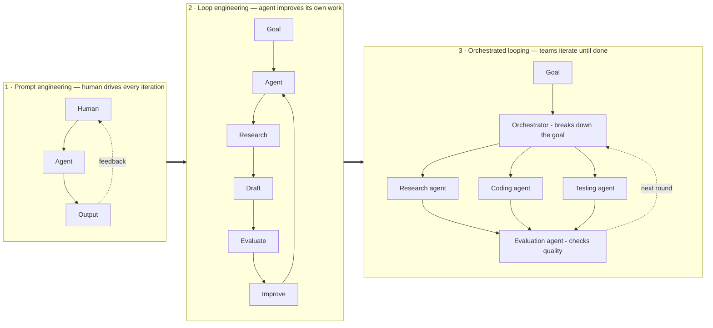

## Mục tiêu

Trả lời đúng chuỗi câu hỏi một builder sẽ hỏi về loop: loop engineering *là gì*, cấu tạo gồm
những phần nào, cần bao nhiêu loop, có bao nhiêu hình dạng, vì sao cần — và có bắt buộc code
trên SDK không, hay dùng được luôn
[Claude Code / Codex]() có sẵn? Mỗi câu hỏi có một
trang riêng; đây là bản đồ.

## Là gì

**Loop engineering là thiết kế chính sự lặp lại, thay vì tự mình ngồi lặp.**
[Prompt engineering]() định hình *một lần gọi
model*; [harness]() chạy *vòng lặp của một agent*;
loop engineering thiết kế **hệ thống các vòng lặp**: cái gì lặp, ai kiểm kết quả, thế nào là
"xong", và cái gì dừng nó lại. Gói trong một câu: bạn thôi làm người prompt agent — bạn xây
cái thứ đi prompt agent.

Điểm mấu chốt: looping là một **cách tổ chức hệ thống, không phải một model**. Nó không phải
tính năng bạn bật lên; nó là một mẫu mà gần như agent framework nào cũng chạy được, tùy cách
bạn nối các thành phần. Đó là lý do mô hình đang dịch từ `Prompt → Output` sang
`Goal → Loop → Evaluate → Improve → Repeat → Result` — và vì sao cả Anthropic lẫn OpenAI giờ
đều khuyến khích kỹ sư xây vòng lặp, không chỉ xây prompt.

## Bậc thang trưởng thành

Mỗi thế hệ sửa đúng cái hỏng của thế hệ trước — đây là hình dạng của cả ngành, và là bản đồ
cho các trang bên dưới:

| Năm | Loop | Bài học nó dạy |
| ------ | ------ | ------ |
| 2022 | **ReAct** — reason → act → observe, một model, một vòng | Lặp thắng trả lời một phát |
| 2023 | **AutoGPT** — vòng lặp theo đuổi mục tiêu | Nổi tiếng vì quay vô tận → loop cần **điều kiện dừng** |
| 2025 | **Ralph loop** — cùng một prompt chạy lại trên các anchor file cố định | Anchor bền giữ các run dài mạch lạc |
| Đầu 2026 | **Productised loop** — validator quyết định khi nào việc xong | "Xong" phải được *kiểm*, không phải tự tuyên bố |
| Giữa 2026 | **Orchestration** — supervisor lập lịch, điều phối các worker loop | Một vòng lặp không scale; đội các vòng lặp thì có |

## Năm trang

| Trang | Câu hỏi nó trả lời |
| ------ | ------ |
| [Cấu tạo của loop]() | Bên trong một loop production có gì |
| [Bốn cấp độ loop]() | Cần bao nhiêu loop, và mỗi loop mua về cái gì |
| [Open vs closed loop]() | Chọn hình dạng nào, khi nào |
| [Fleet looping]() | Looping scale lên đội agent ra sao |
| [Tự xây một loop]() | Dùng tool có sẵn hay SDK riêng |

Hai cách nhìn này bổ sung cho nhau. [Cấp độ]() cho biết **cần bọc bao
nhiêu loop** quanh công việc; các trục bên dưới mô tả **từng loop riêng lẻ** bạn có — nên mọi
loop bạn gặp đều là một điểm trên ba trục độc lập:

| Trục | Lựa chọn | Chi tiết ở |
| ------ | ------ | ------ |
| **Kiến trúc** | Open (khám phá) vs closed (đo được) | [Open vs closed]() |
| **Topology** | Một worker vs fleet điều phối | [Fleet looping]() |
| **Giám sát** | Human in / on / out of the loop | [Fleet looping]() |

## Vì sao cần

- **Gọi một phát chạm trần** — chất lượng đến từ lặp-và-kiểm, và làm tay thì *bạn* thành nút
  cổ chai.
- **Niềm tin đòi validator** — output agent không ai review thì không ship được; loop có
  người kiểm biến "nghe hợp lý" thành "đã kiểm chứng".
- **Kiểm soát chi phí đòi độ đóng** — khám phá mở là chi tiêu khó đoán; closed loop với
  ngưỡng làm chi phí và chất lượng *đo được theo từng run*, nên run sau cải thiện được run
  trước.

> Bạn thôi làm người prompt agent — bạn xây cái thứ đi prompt agent.

Khi orchestration *thực sự* xứng đáng, cấu trúc mà các loop phối hợp chạy trên đó là một graph
— xem [From prompts to graphs]() để thấy
loop engineering nằm ở đâu trong dòng tiến hoá rộng hơn.

## Nguồn

- Osmani, *Loop Engineering* (2026) — [addyo.substack.com](https://addyo.substack.com/p/loop-engineering)
- Yao et al., *ReAct* (2022) — [arXiv:2210.03629](https://arxiv.org/abs/2210.03629)
- [Anthropic — Effective harnesses for long-running agents](https://www.anthropic.com/engineering/effective-harnesses-for-long-running-agents)
