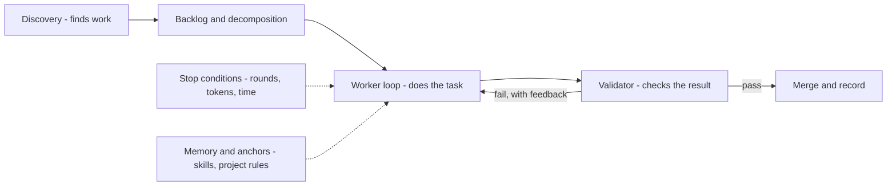

*Bên trong một loop production có gì.*

## Là gì

Một loop production có sáu phần. Worker — agent làm task — là phần *ít* thú vị nhất; chính các
phần bao quanh nó mới biến một demo thành thứ bạn tin để chạy không người canh.

## Sáu thành phần

- **Discovery / automations** — tự tìm việc không cần con người kích hoạt: lịch chạy,
  webhook, scanner. Đây là cái cho loop chạy *không người canh*.
- **Decomposition** — orchestrator chia mục tiêu thành các task worker nhận được. Xem
  [fleet looping]() khi việc này thành nhiều tầng.
- **Worker** — một agent với [tools]() và
  [MCP connector](); worker chạy song song thì cần **git
  worktree** để không ghi đè lên nhau.
- **Validator** — một phán xét thứ hai ([LLM-as-judge](),
  bộ test, hoặc cả hai) quyết định đạt/không đạt — không bao giờ để worker tự chấm mình.
- **Điều kiện dừng** — giới hạn vòng, ngân sách token, phát hiện lặp: bài học AutoGPT, thừa
  kế từ [harness]().
- **Memory & anchors** — [skills](), luật dự án, và
  [agent memory]() để mỗi vòng xây trên vòng trước
  thay vì khám phá lại.

## Ví dụ

Một loop cập nhật dependency hằng đêm: **discovery** là cron trigger; **decomposition** chia
"cập nhật mọi package" thành một task mỗi package; **worker** nâng version và chạy build;
**validator** là bộ test; **điều kiện dừng** chặn ở ba lần thử sửa mỗi package; **anchors** là
ghi chú nâng cấp của dự án để nó không học lại các lỗi đã biết. Chỉ worker là "agent" — năm
phần còn lại mới là cái làm cho việc để nó chạy qua đêm trở nên an toàn.

## Liên quan

- [Open vs closed loop]() — validator chính là cái làm loop thành *closed*.
- [The agent harness]() — nơi điều kiện dừng và memory đến từ.

## Nguồn

- [Anthropic — Effective harnesses for long-running agents](https://www.anthropic.com/engineering/effective-harnesses-for-long-running-agents)
- [AutoGPT](https://github.com/Significant-Gravitas/AutoGPT) — vòng lặp theo đuổi mục tiêu, và các bài học của nó
