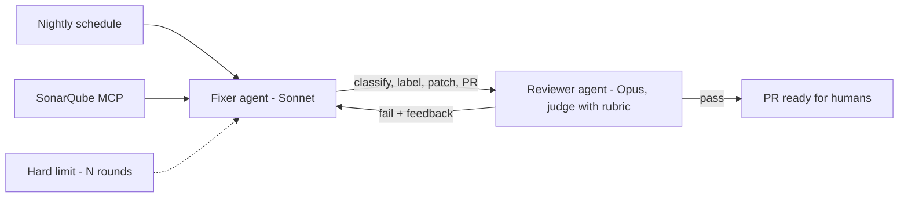

*Xây thật ra sao — và một ví dụ đã làm.*

## SDK, hay dùng luôn Claude Code / Codex?

Câu trả lời thật thà: **bắt đầu bằng công cụ có sẵn — bạn đang sở hữu sẵn một loop chuẩn
production.** Claude Code và Codex *chính là* sản phẩm loop: harness, tools, skills, MCP,
điều kiện dừng có đủ. Có một cái thang, và phải leo từng bậc xứng đáng:

1. **Dùng tool tương tác** — bạn là orchestrator. Đủ cho việc hằng ngày.
2. **Script hóa tool** — chạy headless trong CI theo lịch với prompt cố định, skills và MCP
   server. Đây đã *là* loop engineering — không cần SDK, và phủ được đa số automation closed
   loop (triage hằng đêm, quét sửa lint, cập nhật docs).
3. **Code trên SDK** ([Agent SDK, LangGraph, Microsoft Agent Framework]())
   chỉ khi loop cần thứ tool không cho được: **topology tùy biến** (một fixer và một reviewer
   khác model nói chuyện với nhau), **logic validator và ngưỡng của riêng bạn**, hoặc loop
   *chính là sản phẩm* cần UI, state và versioning riêng.

Quy tắc nhanh: loop của bạn là *một worker + một cái lịch* → script tool đang có. Là *nhiều
vai thương lượng với nhau* → lúc đó SDK mới xứng độ phức tạp của nó.

## Case study — autofixer cho static analysis

Một closed loop thật mình xây khi các đợt scan bảo mật (SonarQube) dồn issue nhỏ nhanh hơn
tốc độ người dọn:

Một **fixer** (Sonnet) kéo issue qua SonarQube MCP server, phân loại và gắn label, vá những
cái an toàn, mở PR. Một **reviewer** (Opus) chấm bản vá theo rubric; không đạt thì trả lý do
về cho fixer — tối đa N vòng (hard limit), hết thì dừng chứ không quay tiếp. Cả hệ chạy theo
lịch trong GitHub Actions, orchestrate bằng một agent framework cộng skills (guidelines,
incremental-implementation, sonar-guardrails).

Đủ mặt cả ba trục: loop **closed**, human **on** the loop (họ review PR, không canh từng
bước), topology **orchestrated** — và nó chỉ cần SDK vì hai model khác nhau phải thương lượng;
riêng nửa discovery hoàn toàn có thể là một coding agent chạy script.

## Điểm mạnh & hạn chế

- **Điểm mạnh** — throughput không còn nút cổ chai con người; validator làm chất lượng thành
  thứ *được cưỡng chế*, không phải được hy vọng; closed loop cho trần chi phí và tiến bộ qua
  từng run; tách người-làm/người-kiểm bắt được cái tự-review không thấy.
- **Hạn chế** — validator có thể bị lừa hoặc sai (thiên lệch judge — hiệu chỉnh với nhãn con
  người); loop khuếch đại một prompt hay rubric tồi với tốc độ máy; orchestration nhân chi
  phí và điểm hỏng — đa số task vẫn xứng với một worker và một cái lịch, không phải một hạm
  đội.

## Liên quan

- [Cấu tạo của loop]() — mọi phần ở trên, gọi đúng tên.
- [Fleet looping]() — khi một worker là không đủ.
- [Tooling & frameworks]() — các SDK nhắc ở đây.

## Nguồn

- Osmani, *Loop Engineering* (2026) — [addyo.substack.com](https://addyo.substack.com/p/loop-engineering)
- Huntley, *Ralph Wiggum as a software engineer* — [ghuntley.com/ralph](https://ghuntley.com/ralph/)
- Zheng et al., *Judging LLM-as-a-Judge (MT-Bench)* (2023) — [arXiv:2306.05685](https://arxiv.org/abs/2306.05685)
- [Claude Code — Headless mode](https://code.claude.com/docs/en/headless)
