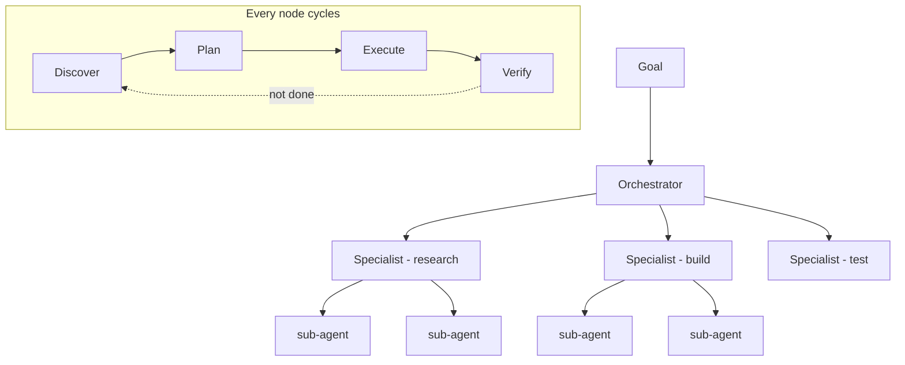

*Trục topology và giám sát — scale looping lên.*

## Là gì

Ở mức đơn giản nhất, một agent tự lặp trên chính công việc của mình: research → draft → đánh
giá theo mục tiêu → sửa điểm yếu → lặp cho tới khi đủ tốt. Bạn không còn prompt từng bước;
agent tự chạy vòng lặp thay bạn.

**Fleet looping** là chính ý đó ở quy mô lớn. Một **orchestrator** nhận mục tiêu tổng thể và
chia thành nhiều phần; nó giao từng phần cho một **specialist agent**; mỗi specialist lại có
thể ủy quyền công việc hẹp hơn cho **sub-agent** của mình. Cả cây task liên tục lặp qua bốn
pha cho tới khi mục tiêu đạt:

Nếu một agent tự lặp giống **một cá nhân** liên tục sửa bản nháp của mình, thì fleet giống
**một đội ngũ hoàn chỉnh** vận hành một dự án từ đầu đến cuối. Bạn định nghĩa mục tiêu; hệ
thống tự chạy cho tới khi đáp ứng tiêu chí.

## Hai trục nó mở ra

Fleet looping là nơi hai trong ba [trục của loop]() sống dậy:

- **Topology** — **single loop** (một worker; đơn giản và thường là đủ) vs **orchestrated**
  (một supervisor cộng các worker chuyên biệt). Chỉ orchestrate khi task thực sự song song hóa
  được hoặc cần tách vai *người-làm* và *người-kiểm* — một fleet nhân cả chi phí lẫn điểm hỏng.
- **Giám sát** — bạn lùi lại xa tới đâu:
  - **Human *in* the loop** — duyệt từng bước (kiểm soát cao nhất, throughput thấp nhất).
  - **Human *on* the loop** — theo dõi, can thiệp khi bất thường.
  - **Human *out* of the loop** — chỉ xem kết quả.

  Đúng cái thang placement của [responsible AI](), áp cho
  loop: bạn tốt nghiệp từ ngồi canh một loop lên thiết kế loop để trông các loop khác.

## Vì sao nó đòi kỷ luật

Một fleet không có **cổng đánh giá** ở mỗi pha sẽ sản ra "rác AI" đầy tự tin ở quy mô lớn —
nhiều loop khuếch đại một rubric tồi nhanh hơn bất kỳ ai kịp bắt. Cổng đó (một
[validator]()) là cái giữ output của fleet trên vạch "đạt chuẩn".
Đó là lý do đa số task vẫn xứng với *một* worker và một cái lịch, không phải một fleet:
orchestration là chi phí bạn chỉ trả khi công việc thực sự song song hóa.

## Ví dụ

"Xuất bản một bài viết launch." Orchestrator sinh ra một specialist **research** (ủy quyền các
sub-agent gom nguồn và trang đối thủ), một specialist **drafting**, và một specialist
**editing** đóng vai cổng đánh giá. Mỗi bên lặp discover → plan → execute → verify; editor bác
các bản nháp lệch brief, trả note về — cho tới khi bài vượt vạch. Một mục tiêu vào, một bài
hoàn chỉnh ra, không ai viết lấy một prompt cho từng bước.

## Liên quan

- [Open vs closed loop]() — trục kiến trúc; fleet gần như luôn chạy closed.
- [From prompts to graphs]() — cấu trúc mà các loop phối hợp chạy trên đó.
- [Multi-agent systems]() — topology và shared memory cho đội agent.

## Nguồn

- Osmani, *Loop Engineering* (2026) — [addyo.substack.com](https://addyo.substack.com/p/loop-engineering)
- [Anthropic — How we built our multi-agent research system](https://www.anthropic.com/engineering/built-multi-agent-research-system)
