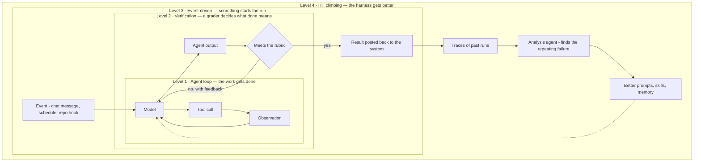

*Bạn cần bao nhiêu loop, và mỗi loop mua về cái gì.*

## Là gì

Bốn cấp độ không phải bốn *loại* loop. Chúng là **một loop được bọc bốn lần** — mỗi cấp bao lấy
cấp bên dưới và thêm một tính chất mà loop bên trong không tự sinh ra được. Nên câu hỏi không
bao giờ là "đây là loop loại nào?" mà là **tôi cần bao nhiêu cấp?**

## Bốn cấp độ

| Cấp | Nó thêm cái gì | Nó tốn cái gì | Chi tiết ở |
| ------ | ------ | ------ | ------ |
| **1 · Agent loop** — model gọi tool cho tới khi nó thấy task đã xong | Tự động hoá | Mỗi bước là một lần gọi model | [The agent harness]() |
| **2 · Verification loop** — grader chấm kết quả theo rubric và trả cái trượt về kèm phản hồi | Độ tin cậy | Độ trễ và token cho mỗi lần thử lại | [Open vs closed loop]() |
| **3 · Event-driven loop** — một tín hiệu từ bên ngoài khởi động run | Độ phủ — agent sống ngay chỗ công việc đang diễn ra | Hạ tầng, và rủi ro kích hoạt nhầm | Trang này |
| **4 · Hill-climbing loop** — trace của các run cũ nuôi một agent đi cải thiện harness | Tốt dần theo thời gian | Một [bộ eval]() bạn tin được | [Self-improving agents]() |

Cấp 2 còn đổi cả *bài toán kinh tế* của cấp 1. Một grader chịu khó trả việc về là một khoản
ngân sách đúng-sai bạn tiêu được chỗ khác: model rẻ cộng grader chặt thường thắng model mạnh
nhất chạy một mình, vì grader bắt được cái model rẻ làm sai mà tổng chi phí các lần thử lại
vẫn thấp hơn. Bạn đang đánh đổi độ trễ lấy tiền. Xem
[chọn model]() cho bậc thang tier mà phép đổi này chạy trên đó.

**Cấp 3 là cấp không ai lên kế hoạch trước.** Một loop không ai khởi động là một loop không ai
dùng. Trigger có thể là lịch chạy, một tin nhắn trong kênh chat, một sự kiện repository (PR mở
ra, issue được gắn nhãn), một email đến, hay cảnh báo từ scanner. Nguyên tắc: đặt trigger ngay
chỗ công việc đang diễn ra — agent bắt người ta mở thêm một tool riêng là kiểu agent nội bộ
chết dần trong im lặng.

## Ví dụ — một docs agent, qua từng cấp

Vẫn agent đó, bọc thêm từng lớp một:

- **Cấp 1** — nó clone repository, đọc trang hiện tại, viết trang mới, và mở pull request kèm
  diff. Hữu ích, nhưng phải có người nhờ nó, và phải có người kiểm lại.
- **Cấp 2** — giờ có grader chạy trước khi nó báo xong: không link chết, và CI xanh. Nếu trượt,
  lý do được trả về cho agent thử lại. Người review thôi nhận những PR hỏng.
- **Cấp 3** — một tin nhắn trong kênh `#docs-please` của team khởi động run, và PR hoàn tất
  được đăng lại đúng thread đó. Không ai phải học tool mới, nên người ta mới thật sự dùng.
- **Cấp 4** — một analysis agent đọc trace của một trăm run gần nhất và thấy cùng một lỗi lặp
  lại: agent liên tục bỏ qua style guide, vì chưa từng có gì đưa nó vào context. Nó đề xuất
  thêm style guide thành một skill. Bản thân thay đổi đó cũng là một pull request.

Cấp 1 tới 3 tự động hoá *công việc*. Cấp 4 tự động hoá *việc cải thiện chính cái đang làm việc*
— và đó là lý do chỉ cấp 4 cộng dồn được, còn ba cấp kia thì không.

## Con người đứng ở đâu

Tự động hoá vòng lặp không đồng nghĩa với bỏ con người ra. Hãy tiêu phán đoán của con người vào
đúng chỗ nó đổi được kết quả, và không tiêu chỗ nào khác:

| Cấp | Con người ngồi ở đâu | Dùng khi |
| ------ | ------ | ------ |
| 1 | Duyệt một tool call nhạy cảm trước khi nó chạy | Hành động không thể hoàn tác hoặc có tác động ra ngoài — chuyển tiền, gửi mail, xoá dữ liệu |
| 2 | *Chính là* grader, hoặc review lại cái grader đã cho qua | Rubric còn đang hình thành, hoặc tín hiệu quá mơ hồ để chấm tự động |
| 3 | Review tạo tác cuối cùng | Output là một đề xuất, không phải một hành động — một PR, một bản nháp, một kế hoạch |
| 4 | Duyệt các thay đổi lên harness trước khi merge | Luôn luôn, cho tới khi bộ eval đủ mạnh để merge dựa trên điểm số |

[Responsible AI]() sở hữu chính các vị trí đặt người, kèm lời
cảnh báo đi cùng: một người review bị chôn dưới đống phê duyệt sẽ ký bừa, và như vậy còn tệ hơn
là không có cổng kiểm nào.

## Liên quan

- [Cấu tạo của loop]() — sáu thành phần bên trong bất kỳ cấp nào.
- [Open vs closed loop]() — cấp 2 chính là cái làm loop thành closed.
- [Self-improving agents]() — cấp 4 thật sự chạy thế nào.

## Nguồn

- Runkle, *The Art of Loop Engineering* (2026) — [langchain.com](https://www.langchain.com/blog/the-art-of-loop-engineering)
- [Anthropic — Effective harnesses for long-running agents](https://www.anthropic.com/engineering/effective-harnesses-for-long-running-agents)
