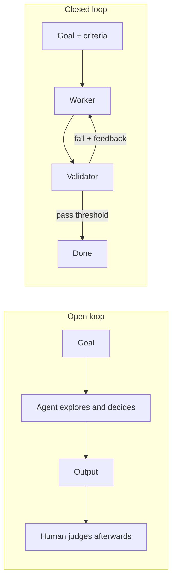

*Trục kiến trúc — chọn hình dạng nào, khi nào.*

## Là gì

Tên gọi mượn từ lý thuyết điều khiển: vòng lặp **closed** đưa output ngược lại và hiệu chỉnh
theo một chuẩn tham chiếu; vòng lặp **open** chạy mà không có đường phản hồi đó. Với agent:

- **Open loop** — agent nhận mục tiêu và sự tự do: nó khám phá, suy luận, tự quyết các bước
  tiếp theo. Không có tiêu chí thành công định trước; run kết thúc khi agent tự tuyên bố xong
  hoặc cạn ngân sách, và *con người* chấm output sau đó.
- **Closed loop** — mục tiêu đi kèm **tiêu chí thành công và validator tường minh**, định
  nghĩa *trước* khi chạy. Mỗi vòng lặp được đo theo tiêu chí; lỗi được đưa ngược về vòng sau;
  "xong" nghĩa là *vượt ngưỡng*, không phải "agent thấy đủ rồi".

| Câu hỏi | Open loop | Closed loop |
| ------ | ------ | ------ |
| Ai quyết bước kế tiếp? | Model, ngay lúc chạy | Quy trình, thiết kế từ trước |
| "Xong" nghĩa là gì? | Agent tự tuyên bố, hoặc cạn ngân sách | Validator vượt ngưỡng |
| Chi phí mỗi run | Khó đoán | Có chặn trên (số vòng × ngân sách) |
| Kết quả giữa các run | Dao động | Lặp lại được |
| Cải thiện được không? | Khó — không có gì được đo | Run sau hơn run trước — mỗi run đều có điểm |
| Rủi ro chính | Đốt token, trôi hướng, chất lượng may rủi | Rubric sai thì bị cưỡng chế với tốc độ máy; giải pháp ngoài khung bị bỏ lỡ |

## Khi nào chọn cái nào

**Chọn open khi** chính bài toán còn chưa được khám phá: bạn chưa biết "tốt" trông thế nào,
việc là spike một lần ("tìm hiểu vì sao đám test này flaky", "vẽ bản đồ codebase legacy này"),
và con người sẽ trực tiếp đọc output. Khám phá là thứ duy nhất closed loop *không* làm được —
vì tiêu chí của nó phải tồn tại sẵn rồi.

**Chọn closed khi** tác vụ lặp lại, chạy không người canh (CI, schedule), tiêu tiền thật, hoặc
output ship ra mà không ai xem từng bước. Production mặc định closed chính vì các lý do đó.

## Hai giai đoạn, không phải đối thủ

Hai loại không phải đối thủ — chúng là **hai giai đoạn của cùng một vòng đời**: chạy open vài
lần để *khám phá ra* tiêu chí, rồi đóng băng tiêu chí đó vào validator và đóng vòng lặp lại.
[Case study autofixer]() đi đúng con đường này: những lần
fix đầu tiên là khám phá, review tay; khi rubric review ổn định, nó trở thành rubric của
reviewer agent.

> Open để khám phá, closed để vận hành — tác vụ nào lặp lại đủ nhiều thì xứng đáng được đóng.

## Liên quan

- [Cấu tạo của loop]() — validator là cái làm "closed" khả thi.
- [Fleet looping]() — hai trục còn lại: topology và giám sát.

## Nguồn

- Yao et al., *ReAct* (2022) — [arXiv:2210.03629](https://arxiv.org/abs/2210.03629)
- [AutoGPT](https://github.com/Significant-Gravitas/AutoGPT) — một open loop không chặn trông ra sao
