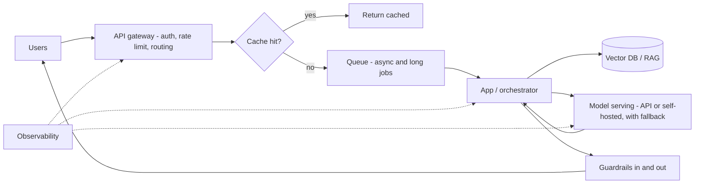

## Mục tiêu

Một lời gọi API chạy được mới chỉ là *khởi đầu*. Khi app AI có người dùng thật, vấn đề mới
xuất hiện: latency tăng, chi phí token phình, nhà cung cấp model rate-limit bạn, và một lỗi
kéo sập cả request. Trang này là nửa **nâng cao** của
[AI system design]() — tầng hạ tầng giúp app nhanh,
rẻ và ổn định ở quy mô.

## Câu chuyện: 10 user → 10.000 user

Một [RAG chatbot]() hoàn hảo với 10 user sẽ vỡ theo
những cách đoán được ở 10.000. Mỗi pattern bên dưới sửa đúng một chỗ vỡ:

## Request path

**API gateway** — cửa trước duy nhất. Nó xác thực, áp **rate limit** (để một user không vét
sạch quota nhà cung cấp), và **định tuyến** request. Với app AI, việc giá trị nhất của nó là
**routing đa nhà cung cấp**: đẩy traffic tới model chính, fail over sang model phụ khi model
chính chết hoặc bị throttle, và định tuyến request rẻ tới model rẻ.

**Load balancing** — rải request qua nhiều instance app (và qua nhiều API key / region) để
không cái nào thành nút cổ chai. Điểm khác của AI: cân theo *tải token*, không chỉ số request
— một request context dài có thể tốn gấp 100 lần một request ngắn.

## Caching — request rẻ nhất là request bạn không gửi

Hai tầng, khác key:

- **Exact cache** — cùng chuỗi input → trả câu trả lời đã lưu. Đơn giản và miễn phí; chỉ trúng
  khi lặp y hệt.
- **Semantic cache** — [embed]() truy vấn và tái dùng
  câu trả lời cũ khi câu hỏi mới *đủ gần* về nghĩa ("chính sách hoàn tiền bao lâu?" ≈ "mình có
  bao lâu để trả hàng?"). Bắt được các câu diễn đạt khác mà exact cache trượt.
- **Prompt cache** — tính năng nhà cung cấp: tái dùng *phần đầu* prompt lặp lại (system prompt,
  context lớn) để giảm độ trễ và chi phí mỗi lần gọi. Khác hai cái trên — nó cache *bên trong*
  một request path, không phải giữa các user.

Cache cái ổn định (tài liệu, FAQ). Đừng cache cái phải tươi hoặc theo từng user (dữ liệu tài
khoản, bất cứ thứ gì có quyết định [guardrail]()) —
một câu trả lời cache cũ trả nhầm user còn tệ hơn một câu trả lời chậm.

## Model serving

**API managed** (Claude, GPT) là mặc định: không GPU, scale tức thì, trả theo token. Chỉ nghĩ
tới **self-host** một open model khi có lý do cụ thể — dữ liệu không được rời mạng nội bộ, khối
lượng cực lớn khiến giá theo token thua chi phí GPU cố định, hoặc bạn cần một model đã fine-tune
trong luồng. Self-host mua được sự kiểm soát và bắt bạn trả bằng ops: dung lượng GPU,
**batching** (gộp các request đồng thời qua GPU để tăng throughput), và autoscaling thành việc
*của bạn*. Đa số team nên ở lại với API lâu hơn nhiều so với họ nghĩ.

## Queue và async

Một lời gọi model có thể mất vài giây tới vài phút — quá lâu để giữ một HTTP request mở ở quy
mô. Đưa việc dài hoặc dồn dập lên một **queue**: request trả về ngay với một job id, một pool
worker xử lý queue, client poll hoặc nhận webhook. Cách này hấp thụ các đợt spike (queue đệm
lại thay vì app đổ), và cho bạn chặn concurrency ở mức quota nhà cung cấp cho phép. Thiết yếu
cho [agent]() và workload batch; một chat một phát
ngắn thì cứ để đồng bộ.

## Reliability

Model sẽ lỗi, timeout, và rate-limit — hãy thiết kế cho điều đó:

- **Timeout + retry** với backoff — nhưng chỉ retry lời gọi idempotent, và chặn số lần thử để
  một sự cố nhà cung cấp không bị khuếch đại thành cơn lũ tự gây ra.
- **Fallback** — model chính lỗi → thử nhà cung cấp phụ hoặc model nhỏ hơn.
- **Circuit breaker** — sau nhiều lần lỗi tới một nhà cung cấp, ngừng gọi nó một khoảng
  cooldown thay vì nện vào một endpoint đã chết.
- **Graceful degradation** — khi đường AI chết hẳn, trả về *một thứ gì đó* hữu ích: kết quả
  cache, keyword search thay cho RAG, hoặc một câu "thử lại sau" thành thật — đừng bao giờ để
  sập 100% chỉ vì một model không khả dụng.

## Chi phí và capacity ở quy mô

[Chi phí mỗi lời gọi]() là chủ đề Giai đoạn 0; ở
quy mô nó thành mối lo *hệ thống*: định tuyến request dễ tới model rẻ, cache mạnh tay, chặn
kích thước context, và batch ở chỗ độ trễ cho phép. Theo dõi chi phí mỗi request trong
[observability]() để một thay đổi prompt làm gấp
đôi token hiện ra thành một hóa đơn, không phải một bất ngờ. Đặt trần ngân sách theo từng user
và toàn cục — một [agent loop]() không có trần chi
phí là một cái ví mở toang.

## Ví dụ — con chatbot, đã scale

Con chatbot 10 user ở mức 10.000 user: một **API gateway** rate-limit và fail over giữa hai
nhà cung cấp model; một **semantic cache** phục vụ ~30% câu hỏi với không lời gọi model nào;
câu trả lời dài đi qua một **queue** để spike không quật đổ app; một **circuit breaker** +
fallback sang model nhỏ hơn giữ nó sống qua một sự cố nhà cung cấp (suy giảm, không sập); và
**trace chi phí mỗi request** bắt được cái ngày ai đó chỉnh prompt làm gấp đôi chi tiêu. Cùng
một sản phẩm — giờ nó sống sót khi chạm traffic thật.

## Điểm mạnh & hạn chế

- **Điểm mạnh** — các pattern này là khác biệt giữa một demo và một dịch vụ: độ trễ đoán được,
  một trần chi phí, và uptime sống sót qua sự cố nhà cung cấp.
- **Hạn chế** — mỗi tầng là độ phức tạp bạn phải chạy và debug; một cache trả câu cũ nếu
  invalidation sai; fallback quá tay có thể che mất tụt chất lượng (một model rẻ hơn trả lời
  âm thầm). Thêm mỗi tầng khi một triệu chứng thật đòi hỏi — đừng thêm sẵn từ đầu. Quy tắc
  [stack phù hợp]() đúng ở đây nhất.

## Nguồn

- [AWS — Generative AI Lens (Well-Architected)](https://docs.aws.amazon.com/wellarchitected/latest/generative-ai-lens/generative-ai-lens.html)
- [Google Cloud — AI and ML architecture guides](https://cloud.google.com/architecture/ai-ml)
- Fowler, *CircuitBreaker* — [martinfowler.com](https://martinfowler.com/bliki/CircuitBreaker.html)
- [Anthropic — Prompt caching](https://platform.claude.com/docs/en/build-with-claude/prompt-caching)
- [Anthropic — Service tiers (rate limits & priority)](https://platform.claude.com/docs/en/api/service-tiers)
