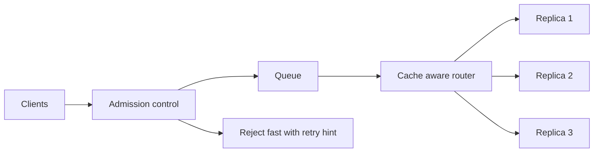

*Cửa trước, và nó làm gì khi có quá nhiều người đến.*

## Mục tiêu

Giữ cho một cụm model replica nhanh và trung thực dưới traffic giật cục: quyết định nhận gì, xếp
hàng gì, từ chối gì, và mỗi request nên đi tới replica nào. Trang này đào sâu
[§Queue và async]() cho trường hợp tự host.

## Vì sao load balancer thông thường là sai ở đây

Một load balancer web giả định request ngắn, rẻ, và thay thế được cho nhau. Request tới model
không thứ nào đúng cả:

| Giả định | Thực tế của inference |
| ------ | ------ |
| Request mất vài mili-giây | Chúng mất vài giây tới vài phút |
| Chi phí mỗi request đồng đều | Prompt 200 token và 100k token lệch nhau 500× |
| Replica nào cũng tốt như nhau | Replica đang giữ tiền tố của bạn trong cache rẻ hơn nhiều |
| CPU cho thấy mức bão hoà | GPU ghim 100% vẫn có thể còn chỗ, hoặc hết sạch |
| Round-robin chia tải đều | Nó chia đều *số request* và chia tải rất tệ |

Vậy nên quyết định thú vị chuyển từ "chọn backend nào" thành **"việc này có nên chạy ngay bây
giờ không, và chạy ở đâu."**

## Admission control và backpressure

Queue không phải chỗ để giấu tình trạng quá tải — một hàng đợi không giới hạn biến bài toán năng
lực thành bài toán độ trễ, và đằng nào mọi request trong đó rồi cũng timeout. Hãy chỉ nhận việc
bạn làm xong được:

- **Giới hạn hàng đợi.** Vượt ngưỡng thì từ chối ngay với `429` kèm `Retry-After`. Một lời từ
  chối nhanh và trung thực là dịch vụ tốt hơn một request chờ 90 giây rồi vẫn thất bại.
- **Đặt ngân sách thời gian chờ.** Bỏ những request đã chờ lâu hơn mức client còn chờ, và ngừng
  trả tiền để tính ra câu trả lời chẳng còn ai nghe.
- **Ước lượng chi phí trước khi nhận.** Số token prompt đã biết trước và `max_tokens` chặn phần
  còn lại, nên bạn có thể từ chối một request không thể nào kịp mục tiêu độ trễ.
- **Tách hàng đợi.** Chat tương tác và batch chạy đêm không nên xếp chung một hàng. Cho mỗi loại
  một hàng đợi và một ngân sách đồng thời riêng, nếu không job batch sẽ bỏ đói người dùng.

**Backpressure phải chạm tới người gọi.** Nếu API của bạn nhận tất cả rồi âm thầm đệm lại, client
sẽ cứ gửi tiếp và sự sụp đổ chỉ bị hoãn — tệ hơn, nó vô hình cho tới lúc đổ vỡ toàn phần.

## Routing theo cache

Đây là thắng lợi lớn đặc thù của inference. Vì
[serving engine]() cache trạng thái KV cho các tiền tố prompt,
đưa request tới replica đã giữ sẵn tiền tố của nó sẽ bỏ qua gần hết phần prefill.

- **Dính theo tiền tố / phiên** — băm system prompt hoặc id hội thoại rồi gửi các request khớp
  nhau về cùng một replica. Cực kỳ hiệu quả cho chat nhiều lượt và
  [agent loop](), nơi mỗi lượt gửi lại một context
  gần như y hệt.
- **Ít việc chờ nhất, không phải round-robin** — định tuyến theo độ sâu hàng đợi và mức chiếm
  dụng KV cache của từng replica, tức những chỉ số thật sự phản ánh tải.
- **Luôn chừa đường thoát** — dính replica mà vẫn dính cả khi replica đó đã quá tải là một lỗi.
  Hãy rơi về replica ít tải nhất khi cái được ưu tiên đã bão hoà.

## Autoscale đúng tín hiệu

Mức sử dụng GPU là tín hiệu scale tồi: một replica đang decode hiện mức sử dụng cao trong khi
phần lớn thời gian chỉ chờ bộ nhớ. Hãy scale theo thứ người dùng cảm nhận được:

| Tín hiệu | Vì sao nó đúng |
| ------ | ------ |
| **Độ sâu / thời gian chờ hàng đợi** | Tỷ lệ thuận trực tiếp với độ trễ người dùng chịu |
| **Mức chiếm dụng KV cache** | Trần năng lực thật — đầy là mức đồng thời dừng lại |
| **Thời gian tới token đầu tiên** | Triệu chứng người dùng thấy được của tranh chấp prefill |

Hai lưu ý. Replica GPU mất **vài phút** mới sẵn sàng — tải model, nạp, và làm nóng — nên hãy
scale theo chỉ báo sớm và giữ sẵn dư địa ấm; scale phản ứng luôn tới sau khi đỉnh tải đã qua. Và
hãy scale *xuống* chậm: đập lên đập xuống một pool GPU rất tốn kém, cả tiền lẫn cold start.

## Điểm mạnh & giới hạn

- **Điểm mạnh** — hàng đợi có giới hạn cộng admission control biến một cú sụp đổ toàn phần thành
  sự xuống cấp từ tốn và trung thực; routing theo cache gần như là throughput miễn phí với
  workload nặng tiền tố; autoscale theo độ sâu hàng đợi bám sát trải nghiệm người dùng tốt hơn
  nhiều so với mức sử dụng CPU hay GPU.
- **Giới hạn** — mỗi lớp thêm độ trễ và thêm một thứ phải vận hành; dính replica xung đột với
  chia tải đều và cần một cơ chế ghi đè; ngân sách thời gian chờ và ngưỡng admission phụ thuộc
  workload, phải tinh chỉnh bằng traffic thật; và tất cả những thứ này vô dụng nếu một replica bị
  cấu hình sai — nó sẽ chỉ phân phối vấn đề ra đều hơn.

## Đi tiếp

- Khi chính nhà cung cấp hay model hỏng → [Routing & fallback]().
- Tinh chỉnh một replica trước khi thêm replica → [Serving engines]().
- Cần đo đạc những gì → [Observability]().

## Nguồn

- Yu et al., *Orca: A Distributed Serving System for Transformer-Based Generative Models* (OSDI, 2022) — [usenix.org](https://www.usenix.org/conference/osdi22/presentation/yu)
- Zheng et al., *SGLang: Efficient Execution of Structured Language Model Programs* (2023) — [arXiv:2312.07104](https://arxiv.org/abs/2312.07104)
- [vLLM — Production metrics](https://docs.vllm.ai/en/latest/usage/metrics.html)
- [Google SRE Book — Handling overload](https://sre.google/sre-book/handling-overload/)
