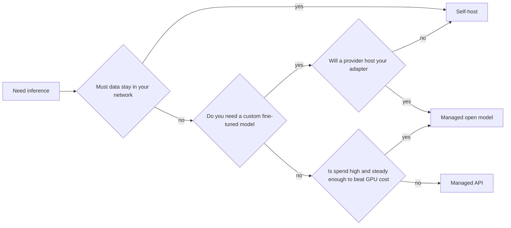

*Cánh cổng cho cả phần này.*

## Mục tiêu

Quyết định một cách trung thực: tự host một open model, hay ở lại với managed API. Đây là quyết
định đắt nhất trong phần này, thường được đưa ra vì lý do sai, và mọi trang còn lại ở đây chỉ có
ý nghĩa nếu bạn trả lời "tự host."

## Ba lựa chọn

| Lựa chọn | Bạn chạy gì | Bạn trả tiền cho | Mở rộng nhờ |
| ------ | ------ | ------ | ------ |
| **Managed API** | Không gì cả | Token | Là việc của người khác |
| **Managed open model** | Không gì cả; open model trên GPU của nhà cung cấp | Token, hoặc GPU-hour | Autoscaling của nhà cung cấp |
| **Tự host** | Trọng số, engine, GPU, tất tần tật | GPU-hour, dùng hay không cũng trả | Bạn, một cách chủ động |

Dòng giữa là dòng người ta hay quên. Nhiều nhà cung cấp phục vụ open weights theo token, cho bạn
quyền chọn model và khả năng di chuyển mà không cần sở hữu một GPU nào.
**Đó mới là bước đầu tiên đúng đắn khi rời một closed API — không phải nhảy thẳng sang cụm GPU riêng.**

## Ba lý do chính đáng để tự host

Chỉ có ba lý do đứng vững. Nếu lý do của bạn không nằm trong danh sách này, nhiều khả năng đó là
sở thích.

- **Data residency** — về mặt pháp lý, dữ liệu không được rời khỏi mạng của bạn. Ngành được quản
  lý chặt, một số công việc thuộc khu vực công, một số thoả thuận dữ liệu EU. Đây là lý do duy
  nhất không phải một đánh đổi: nó là ràng buộc, và nó tự nó kết thúc cuộc tranh luận.
- **Kinh tế theo sản lượng** — giá per-token là tiền thuê. Vượt một mức throughput ổn định nào
  đó, sở hữu hoặc đặt trước GPU sẽ rẻ hơn. Từ khoá là *ổn định*: GPU vẫn tính tiền khi nhàn rỗi,
  nên traffic giật cục phá huỷ chính phép tính đã khiến việc tự host trông hấp dẫn.
- **Một model không ai phục vụ bạn** — một bản fine-tune, một bản merge, một model nghiên cứu,
  hoặc một model có giấy phép khiến nó không lên được các nền tảng managed. Hãy đọc
  [Adaptation]() trước khi cho rằng bạn cần điều này.

Những lý do **không** chính đáng: độ trễ (một region managed ở gần thường thắng), chi phí ở sản
lượng thấp (không bao giờ thắng), quyền riêng tư như một cảm giác thay vì một điều khoản hợp
đồng (hãy đọc điều khoản zero-retention của nhà cung cấp trước), và "chúng tôi muốn kiểm soát"
mà không nói được sẽ làm gì với quyền kiểm soát đó.

## Ước lượng phần cứng

Con số đầu tiên là **VRAM cho trọng số**: xấp xỉ *số tham số × số byte mỗi tham số*.
Ở FP16 là 2 byte mỗi tham số, nên model 7B cần ~14 GB trước khi tính bất cứ thứ gì khác.

| Kích cỡ model | FP16 | INT8 | INT4 |
| ------ | ------ | ------ | ------ |
| 7B | ~14 GB | ~7 GB | ~4 GB |
| 13B | ~26 GB | ~13 GB | ~7 GB |
| 70B | ~140 GB | ~70 GB | ~35 GB |

Rồi cộng thêm phần khiến người ta bất ngờ: **KV cache**, phần bộ nhớ theo từng request giữ trạng
thái attention cho mọi token đang xử lý. Nó lớn lên theo độ dài context *và* theo số request
đồng thời, và ở mức đồng thời cao nó có thể ngang ngửa chính phần trọng số. Một model "vừa 24
GB" có thể chỉ vừa cho đúng một người dùng.

Đó là lý do trang kế tiếp tồn tại: [quantization]() là cách bạn
mua lại khoảng trống, còn [serving engines]() là cách bạn
ngăn KV cache phung phí nó.

## Những chi phí không ai đưa vào bảng tính

Phép so sánh thường được viết là *GPU-hour vs tiền token*, và đó mới là nửa dễ:

- **Thời gian nhàn rỗi.** Managed API tốn 0 đồng lúc 3 giờ sáng. GPU đã đặt trước tốn đúng bằng
  lúc cao điểm. Hãy so với mức sử dụng *trung bình* của bạn, không phải mức đỉnh.
- **Ops.** Phiên bản driver và CUDA, nâng cấp engine, sự cố OOM lúc 2 giờ sáng, hoạch định năng
  lực, và một kịch bản rollback. Đây là chi phí kỹ thuật thường trực, không phải setup một lần.
- **Nâng cấp model.** Nhà cung cấp ra model tốt hơn và bạn đổi một chuỗi ký tự. Tự host thì bạn
  benchmark lại, quantize lại, tinh chỉnh lại, rồi deploy lại.
- **Khoảng cách chất lượng.** Open weights đã rút ngắn phần lớn khoảng cách, nhưng ở những tác vụ
  suy luận và dùng tool khó nhất, các closed model tiên phong vẫn đang dẫn trước. Hãy đo nó trên
  [eval set]() của *chính bạn* trước khi cam kết.

## Điểm mạnh & giới hạn

- **Điểm mạnh của tự host** — dữ liệu không bao giờ rời đi; chi phí cố định, dự đoán được ở sản
  lượng cao và ổn định; dùng model nào tuỳ ý, kể cả bản fine-tune của riêng bạn; không bị rate
  limit hay lịch khai tử của nhà cung cấp.
- **Giới hạn** — gánh nặng ops có thật; GPU nhàn rỗi vẫn tính tiền; bạn sở hữu mọi sự cố; trần
  chất lượng là những gì open weights có hôm nay; và điểm hoà vốn cao hơn nhiều so với ước tính
  của hầu hết team, vì bảng tính thường bỏ sót toàn bộ mục phía trên.

> Hãy ở lại với managed API cho tới khi bạn gọi tên được lý do nào trong ba lý do trên áp dụng cho mình.

## Đi tiếp

- Bạn quyết định tự host → [Quantization]() để model vừa phần cứng.
- Bạn ở lại với API → [Routing & fallback](), áp dụng nguyên vẹn.
- Chọn *model nào*, tự host hay không → [Choosing a model]().

## Nguồn

- [Hugging Face — Model memory anatomy](https://huggingface.co/docs/transformers/model_memory_anatomy)
- [vLLM — Conserving memory and KV cache configuration](https://docs.vllm.ai/en/latest/configuration/conserving_memory.html)
- Kwon et al., *Efficient Memory Management for Large Language Model Serving with PagedAttention* (2023) — [arXiv:2309.06180](https://arxiv.org/abs/2309.06180)
