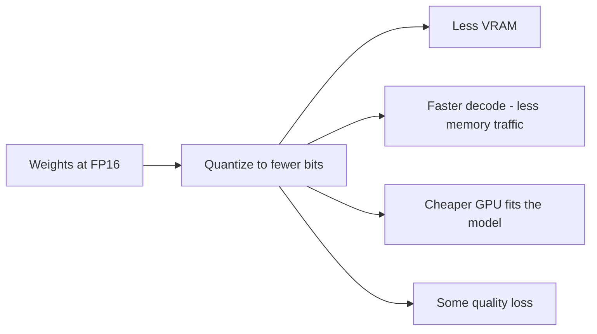

*Làm sao một model cần 140 GB lại chạy được trên card 48 GB.*

## Mục tiêu

Hiểu đòn bẩy duy nhất quyết định model có vừa phần cứng của bạn hay không, nó lấy đi bao nhiêu
chất lượng, và trong mớ tên gọi rối rắm — AWQ, GPTQ, GGUF — bạn thật sự cần cái nào.

## Là gì

Trọng số của model là những con số. Huấn luyện tạo ra chúng ở độ chính xác cao;
**inference hiếm khi cần đến mức đó**. Quantization lưu mỗi trọng số bằng ít bit hơn — từ 16
xuống 8, hoặc 4 — rồi giải nén tại chỗ trong lúc nhân ma trận.

Bạn nhận ba thứ cùng lúc, và trả bằng một loại tiền tệ duy nhất:

Tốc độ là phần người ta hay bỏ sót. Sinh token bị **giới hạn bởi băng thông bộ nhớ**, không phải
bởi khả năng tính toán: GPU đọc toàn bộ tập trọng số cho *mỗi* token nó sinh ra. Giảm một nửa số
byte thì gần như giảm một nửa lượng đọc — đó là lý do INT4 decode nhanh hơn FP16 trên cùng một
card, dù phép tính chẳng hề đơn giản hơn.

## Thang độ chính xác

| Độ chính xác | Bit | Bộ nhớ so với FP16 | Chất lượng điển hình | Dùng cho |
| ------ | ------ | ------ | ------ | ------ |
| **FP32** | 32 | Gấp 2× | Tham chiếu | Huấn luyện, gần như không dùng cho inference |
| **FP16 / BF16** | 16 | Mốc chuẩn | Mốc để mọi thứ khác đo theo | Độ chính xác serving mặc định |
| **FP8** | 8 | 0,5× | Gần như không mất mát trên phần cứng mới | GPU NVIDIA đời mới có hỗ trợ gốc |
| **INT8** | 8 | 0,5× | Rất sát mốc chuẩn | Lựa chọn an toàn cho production |
| **INT4** | 4 | 0,25× | Thấy được nhưng thường chấp nhận được | Nhét model lớn vào card nhỏ |
| **INT3 / INT2** | 3–2 | 0,19× / 0,13× | Xuống cấp nặng | Thử nghiệm, không phải production |

**BF16 vs FP16**: cùng 16 bit, chia khác nhau. BF16 giữ dải số mũ của FP32 và bớt phần định trị,
nên hiếm khi tràn số — đây là mặc định an toàn hơn ở nơi phần cứng hỗ trợ.

Hình dạng thật của đường cong: FP16 → INT8 gần như không mất gì. INT8 → INT4 mới là chỗ bạn bắt
đầu đánh đổi chất lượng thật, và nó làm tổn thương model nhỏ nặng hơn model lớn nhiều.
**Một model 70B ở INT4 thường thắng một model 13B ở FP16 trên cùng ngân sách VRAM** — khi buộc
phải chọn, hãy lấy model lớn hơn ở độ chính xác thấp hơn.

## Ba định dạng

Đây là chỗ gây nhầm lẫn, vì ba cái tên này không cùng một *loại* thứ.

| Định dạng | Nó là gì | Chạy trên | Chọn khi |
| ------ | ------ | ------ | ------ |
| **GPTQ** | Một *thuật toán* quantize sau huấn luyện, từng lớp một, dùng tập hiệu chuẩn | GPU | Bạn muốn hỗ trợ 4-bit trên GPU đã chín và công cụ phong phú |
| **AWQ** | Một *thuật toán* bảo vệ khoảng 1% trọng số mà activation quan tâm nhất | GPU | Bạn muốn chất lượng 4-bit tốt hơn GPTQ, kèm kernel nhanh |
| **GGUF** | Một *định dạng file* / container, từ `llama.cpp`, chứa trọng số ở nhiều mức quantization | CPU, Apple Silicon, GPU offload | Bạn chạy cục bộ, trên Mac, hoặc không có GPU CUDA |

Vậy GPTQ và AWQ trả lời *"trọng số đã được làm tròn thế nào?"*; còn GGUF trả lời *"đây là file
gì, và cái gì chạy được nó?"*. So sánh AWQ với GGUF là so một phương pháp với một cái hộp đựng.

**Ý tưởng của AWQ trong một câu**: không phải trọng số nào cũng quan trọng như nhau — một phần
nhỏ, được nhận diện bằng cách nhìn vào độ lớn của *activation* thay vì của chính trọng số, mang
phần lớn chất lượng, nên hãy co giãn nhóm đó trước khi làm tròn thì thiệt hại giảm hẳn. Trên
thực tế AWQ thường nhỉnh hơn GPTQ ở cùng số bit, và cả hai đều tốt hơn hẳn làm tròn ngây thơ.

**GGUF k-quants**: bên trong GGUF bạn sẽ thấy những tên như `Q4_K_M` hay `Q5_K_S`. Đọc chúng
theo kiểu *số bit · k-quant · biến thể kích cỡ* — `Q4_K_M` là 4-bit, k-quant, medium. Các
k-quant trộn nhiều mức chính xác trong cùng một tensor, dành nhiều bit hơn cho chỗ quan trọng.
`Q4_K_M` là mặc định thường được khuyến nghị; `Q5_K_M` nếu bạn còn chỗ; dưới `Q4` chỉ khi buộc phải.

## Cần đo gì

Quantization là thay đổi duy nhất trong phần này có thể âm thầm làm sản phẩm của bạn tệ đi, nên
đừng bao giờ ship nó theo cảm tính. Trước và sau, trên cùng một bộ đầu vào:

- **Eval set của bạn** — độ chính xác tác vụ trên truy vấn thật, không phải benchmark công khai.
  Xem [Evaluation in practice]().
- **Token mỗi giây** ở mức đồng thời thật của bạn, không phải chạy đơn luồng.
- **VRAM đỉnh** bao gồm cả KV cache dưới tải, không chỉ trọng số lúc đứng yên.
- **Tuân thủ định dạng** — model đã quantize xuống cấp ở
  [structured output]() và tool calling sớm hơn hẳn so với
  khi viết văn xuôi. Nếu một [agent]() phụ thuộc vào JSON
  sạch, hãy kiểm tra riêng điều đó.

Ý cuối là cái bẫy thực tế: một model 4-bit vẫn viết được đoạn văn trôi chảy có thể đã lặng lẽ trở
nên không đáng tin khi phải sinh ra một lời gọi tool hợp lệ.

## Điểm mạnh & giới hạn

- **Điểm mạnh** — giảm 2–4× bộ nhớ biến một deployment bất khả thi thành rẻ tiền; decode nhanh
  hơn như tác dụng phụ miễn phí; INT8 gần như không mất mát; đã có sẵn checkpoint quantize nên
  thường bạn chỉ tải về chứ không phải tự tính gì.
- **Giới hạn** — mất chất lượng là có thật, phụ thuộc tác vụ, và tệ nhất ở model nhỏ, context
  dài, và structured output; định dạng phải khớp với serving engine và GPU của bạn; tự quantize
  cần tập hiệu chuẩn và thời gian GPU; và nó chẳng giúp gì cho KV cache — thứ thường mới là
  nguyên nhân thật khiến bạn hết bộ nhớ.

## Đi tiếp

- Đặt một engine trước trọng số đã quantize → [Serving engines]().
- Quyết định xem có nên tự host không → [Local vs cloud]().
- Thay đổi hành vi model, không phải độ chính xác → [Adaptation]().

## Nguồn

- Frantar et al., *GPTQ: Accurate Post-Training Quantization for Generative Pre-trained Transformers* (2022) — [arXiv:2210.17323](https://arxiv.org/abs/2210.17323)
- Lin et al., *AWQ: Activation-aware Weight Quantization for LLM Compression and Acceleration* (2023) — [arXiv:2306.00978](https://arxiv.org/abs/2306.00978)
- Dettmers et al., *LLM.int8(): 8-bit Matrix Multiplication for Transformers at Scale* (2022) — [arXiv:2208.07339](https://arxiv.org/abs/2208.07339)
- Dettmers & Zettlemoyer, *The case for 4-bit precision: k-bit Inference Scaling Laws* (2022) — [arXiv:2212.09720](https://arxiv.org/abs/2212.09720)
- [llama.cpp — GGUF file format specification](https://github.com/ggml-org/ggml/blob/master/docs/gguf.md)
