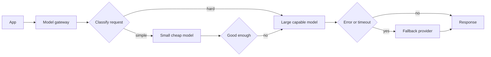

*Hai pattern mà mọi app AI production đều cần — tự host hay không.*

## Mục tiêu

Thôi coi "model" như một phụ thuộc cố định duy nhất. Hãy đưa mỗi request tới model rẻ nhất xử lý
được nó, và xuống cấp êm ái khi một model quá tải, bị rate limit, hoặc biến mất. Trang này đào
sâu [§Reliability]() và áp dụng nguyên vẹn dù bạn
tự host hay gọi managed API.

## Gateway

Cả hai pattern đều sống ở một chỗ: một **model gateway** nằm giữa app và mọi model, để "model
nào trả lời" trở thành một quyết định chính sách thay vì một hằng số rải rác khắp code.

Hãy xây nó như một lớp nội bộ mỏng, không phải một cuộc viết lại: một hàm nhận request và trả về
response, sở hữu việc chọn model, retry, và chuỗi fallback.

## Routing — đúng model cho mỗi request

Phần lớn traffic không cần model tốt nhất của bạn. Phân loại, trích xuất, định tuyến, tóm tắt và
định dạng lại đều được các model nhỏ xử lý tốt với chi phí và độ trễ chỉ bằng một phần nhỏ.

| Chiến lược | Quyết định thế nào | Hợp với | Cẩn thận |
| ------ | ------ | ------ | ------ |
| **Tĩnh theo tác vụ** | Nơi gọi chỉ định model | Workload rõ ràng, tách bạch | Lạc hậu dần khi model thay đổi |
| **Leo thang / cascade** | Thử model rẻ, leo thang nếu câu trả lời trượt kiểm tra | Độ khó pha trộn trong cùng một endpoint | Hai lời gọi khi leo thang — bài kiểm tra phải rẻ hơn phần tiết kiệm được |
| **Bộ phân loại** | Một model nhỏ hoặc heuristic gán nhãn độ khó trước | Sản lượng lớn, độ khó trải rộng | Bộ phân loại giờ cũng là thứ phải đánh giá |
| **Theo năng lực** | Cần vision, tool, context dài, hay JSON | App đa phương thức và agentic | Config phình ra |

**Leo thang là biến thể có đòn bẩy cao nhất**, và nó sống chết nhờ bài kiểm tra: một
[grader](), một lần validate schema, một tín
hiệu độ tin cậy, hay một phép thử mức bám nguồn. Nếu việc quyết định tốn ngang model lớn thì
cascade chẳng mang lại gì.

Hai nguyên tắc giữ cho việc này trung thực. **Định tuyến dựa trên khác biệt đo được, không phải
phỏng đoán** — hãy xây chính sách routing dựa trên
[eval set]() của bạn, và kiểm lại khi model
thay đổi. Và **log lại model nào đã phục vụ mỗi request**, nếu không bạn sẽ gỡ một phàn nàn về
chất lượng mà chẳng biết cái gì đã sinh ra câu trả lời đó.

## Fallback — sống sót qua sự cố

Model hỏng theo năm kiểu phân biệt được, và chúng không muốn cùng một cách phản ứng:

| Sự cố | Phản ứng đúng |
| ------ | ------ |
| **Rate limit (429)** | Lùi lại rồi thử lại, tôn trọng `Retry-After`, sau đó đẩy sang nhà cung cấp khác |
| **Timeout / chậm** | Huỷ và thử lại một lần ở nơi khác — đừng chồng retry lên một endpoint đang đuối |
| **Lỗi server (5xx)** | Retry có jitter, sau đó bật circuit breaker |
| **Content filter / từ chối** | *Đừng* retry mù — nó sẽ từ chối tiếp. Hãy đưa ra ngoài hoặc định tuyến lại có chủ đích |
| **Output hỏng (JSON không hợp lệ)** | Retry một lần kèm chính lỗi đó; rồi rơi về model chặt chẽ hơn hoặc lớn hơn |

Những cơ chế khiến việc này an toàn:

- **Retry với exponential backoff và jitter**, có trần. Retry không trần trong một sự cố của nhà
  cung cấp sẽ biến một lỗi thành một trận lụt tự gây ra.
- **Circuit breaker.** Sau nhiều lần hỏng liên tiếp, ngừng gọi endpoint đó trong một khoảng nghỉ
  và trượt nhanh sang fallback. Nện vào một nhà cung cấp đã chết chỉ tiêu tốn ngân sách độ trễ
  của chính bạn.
- **Hedged request, thận trọng.** Bắn lời gọi thứ hai khi lời gọi đầu vượt p95 sẽ cắt tail
  latency nhưng nhân chi phí lên — hãy giới hạn ở một tỷ lệ nhỏ của traffic.
- **Idempotency.** Retry chỉ an toàn nếu một lời gọi bị lặp không thể tính tiền hai lần hay ghi
  hai lần. Hãy truyền một request key và làm cho tác dụng phụ của tool idempotent, nhất là bên
  trong một [agent loop]().

## Xuống cấp êm ái

Tuyến phòng thủ cuối cùng là quyết định "hỏng" trông như thế nào với người dùng. Theo thứ tự chất
lượng giảm dần: câu trả lời từ cache → model nhỏ hơn hoặc cũ hơn → đường không-AI (tìm kiếm từ
khoá thay cho [RAG](), một template thay cho bản tóm tắt do model sinh) →
một thông báo lỗi trung thực có nói khi nào nên quay lại.

**Đừng bao giờ để sự cố của một nhà cung cấp thành sự cố 100%.** Hãy thiết kế đường xuống cấp
trước khi cần đến nó, và diễn tập nó — một fallback chưa từng được kiểm thử thì không phải fallback.

> Hãy quyết định trước điều gì tệ hơn với người dùng của bạn: câu trả lời chậm hơn, câu trả lời
> yếu hơn, hay không có câu trả lời. Mọi lựa chọn trong trang này đều suy ra từ đó.

## Điểm mạnh & giới hạn

- **Điểm mạnh** — routing thường cắt đáng kể chi phí mà không mất chất lượng ở phần traffic dễ;
  fallback loại bỏ điểm chết đơn lẻ; gateway gom việc theo dõi chi phí, logging và thay model về
  một chỗ.
- **Giới hạn** — câu trả lời giờ thay đổi tuỳ model nào phục vụ, làm việc đánh giá và tái lập
  phức tạp hơn; cascade thêm độ trễ mỗi khi leo thang; mỗi nhà cung cấp thêm vào là thêm một hợp
  đồng, một định dạng prompt và một hành vi phải bảo trì; và prompt đã tinh chỉnh cho một model
  hiếm khi tối ưu trên model dự phòng của nó, nên chất lượng trên đường xuống cấp cũng phải được đo.

## Đi tiếp

- Góc nhìn cấp cụm của việc này → [Load balancing & queuing]().
- Bức tranh production rộng hơn → [Scaling to production]().
- Theo dõi chi phí và model đã chọn theo từng request → [Observability]().
- Chọn các model để định tuyến giữa chúng → [Choosing a model]().

## Nguồn

- Chen et al., *FrugalGPT: How to Use Large Language Models While Reducing Cost and Improving Performance* (2023) — [arXiv:2305.05176](https://arxiv.org/abs/2305.05176)
- Ong et al., *RouteLLM: Learning to Route LLMs with Preference Data* (2024) — [arXiv:2406.18665](https://arxiv.org/abs/2406.18665)
- Dean & Barroso, *The Tail at Scale* (CACM, 2013) — [doi:10.1145/2408776.2408794](https://doi.org/10.1145/2408776.2408794)
- [Google SRE Book — Addressing cascading failures](https://sre.google/sre-book/addressing-cascading-failures/)
