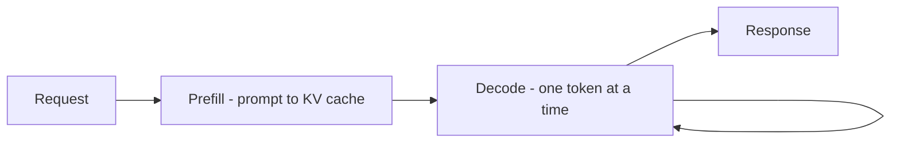
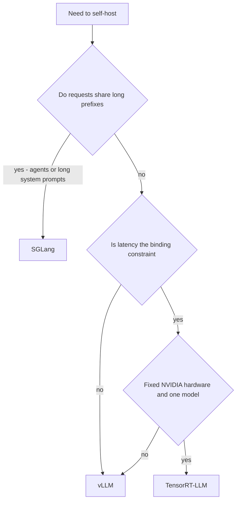

*Vì sao cùng một GPU phục vụ 5 người hay 100 người, tuỳ vào phần mềm đặt phía trước.*

## Mục tiêu

Hiểu một serving engine thật sự làm gì, vì sao nó đáng giá 5–20× throughput so với một vòng lặp
sinh token thẳng tuột, và chọn thế nào giữa ba engine đáng quan tâm.

## Hai pha của một request

Mọi lần sinh văn bản đều tách thành hai pha có tính chất hiệu năng hoàn toàn khác nhau, và gần
như mọi thứ engine làm đều bắt nguồn từ sự phân đôi này:

| Pha | Chuyện gì xảy ra | Bị giới hạn bởi | Hình dạng chi phí |
| ------ | ------ | ------ | ------ |
| **Prefill** | Xử lý cả prompt một lượt, nạp đầy KV cache | Tính toán | Một lượt song song lớn |
| **Decode** | Sinh một token, nối vào KV cache, lặp lại | Băng thông bộ nhớ | Hàng trăm lượt nhỏ, tuần tự |

Prefill là chạy nước rút; decode là đi bộ đường dài. Trong lúc decode, GPU chủ yếu *chờ bộ nhớ*
còn các nhân tính toán thì nhàn rỗi — và đó đúng là khoảng trống mà engine lấp đầy bằng cách
chạy bước decode của nhiều request cùng lúc.

## Engine mua cho bạn điều gì

Ba ý tưởng làm phần lớn công việc:

- **Continuous batching.** Batching tĩnh chờ cả lô xong mới bắt đầu lô kế, nên một lần sinh dài
  bắt chín lần sinh ngắn làm con tin. Continuous batching làm việc ở mức *token*: ngay khi một
  chuỗi kết thúc, một request đang xếp hàng chiếm chỗ đó. Riêng điều này đã là khoản tăng
  throughput lớn nhất.
- **PagedAttention.** Trước đây KV cache được cấp phát thành một khối liền mạch cho mỗi request,
  đủ cho trường hợp xấu nhất — và phần lớn bị lãng phí. vLLM mượn đúng mẹo của bộ nhớ ảo: chia
  cache thành các *page* kích thước cố định, cấp phát theo nhu cầu, chia sẻ page giữa các chuỗi
  có chung tiền tố. Lãng phí giảm từ ~60–80% xuống còn vài phần trăm, và phần bộ nhớ thu hồi
  được đó trở thành mức đồng thời.
- **Tái dùng tiền tố.** Các request dùng chung phần đầu — một system prompt dài, một khối
  few-shot, một lịch sử hội thoại — có thể dùng chung KV cache của phần đó thay vì tính lại. Khi
  prompt của bạn có phần đầu cố định lớn, điều này cắt giảm prefill rất mạnh.

Kết quả là throughput chủ yếu là bài toán *quản lý bộ nhớ*, không phải bài toán tính toán. Một
engine đáng giá hơn nhiều so với một GPU nhanh hơn.

## Ba engine

| Engine | Ý tưởng cốt lõi | Phần cứng | Mạnh nhất ở | Cái giá |
| ------ | ------ | ------ | ------ | ------ |
| **vLLM** | PagedAttention + continuous batching | NVIDIA, AMD, và khác | Serving đa dụng; lựa chọn mặc định | Rất ít — dễ áp dụng nhất |
| **TensorRT-LLM** | Kernel biên dịch trước, gắn chặt phần cứng | Chỉ NVIDIA | Vắt nốt 20–40% độ trễ cuối cùng trên phần cứng đã biết | Một bước build cho mỗi model *và* mỗi GPU; cứng nhắc |
| **SGLang** | RadixAttention — cây tiền tố trên KV cache | NVIDIA, AMD | Tiền tố dùng chung nhiều: agent, chat nhiều lượt, chương trình có cấu trúc | Mới hơn, hệ sinh thái nhỏ hơn |

**RadixAttention trong một câu**: giữ các tiền tố đã cache trong một cây radix để *bất kỳ*
request mới nào cũng tự động tái dùng tiền tố khớp dài nhất đang có trong bộ nhớ, thay vì chỉ
xử lý đúng một tiền tố mà bạn đã khai báo. Đó là lý do nó toả sáng với
[agent loop](), nơi mỗi vòng lặp gửi lại một context
dài và gần như giống hệt nhau.

## Chọn một cái

**Hãy bắt đầu với vLLM.** Đó là mặc định trung thực: hỗ trợ model rộng, throughput tốt ngay từ
đầu, và ít bất ngờ vận hành nhất. Chỉ chuyển sang TensorRT-LLM khi bạn đã *đo được* một mục tiêu
độ trễ đang không đạt, trên phần cứng bạn kiểm soát và sẽ không đổi trong thời gian tới. Chọn
SGLang khi workload của bạn nặng tiền tố — chỗ nó thắng nhờ bản chất thiết kế chứ không nhờ tinh chỉnh.

## Những núm vặn quan trọng

Dù chọn engine nào, vẫn chỉ ngần ấy núm quyết định hành vi:

- **Số chuỗi đồng thời tối đa** — bao nhiêu request chia nhau GPU. Cao quá thì độ trễ mỗi người
  dùng sụp đổ; thấp quá thì GPU nhàn rỗi.
- **Tỷ lệ bộ nhớ cho KV cache** — cache được phép chiếm bao nhiêu VRAM. Tăng lên thì mua được
  mức đồng thời và lấy mất chỗ mà trọng số có thể cần.
- **Độ dài context tối đa** — chặn trần cache xấu nhất cho mỗi request. Quảng cáo cửa sổ 128k mà
  bạn không phục vụ nổi ở mức đồng thời là một sự cố tự gây ra rất phổ biến.
- **Tensor parallelism** — xẻ một model ra nhiều GPU khi nó không vừa một cái.

Mọi núm ở trên đều là cùng một đánh đổi: **đồng thời nhiều hơn, tail latency tệ hơn**. Hãy quyết
định bạn đang tối ưu cái nào trước khi vặn, và theo dõi cả hai trong
[observability]().

## Điểm mạnh & giới hạn

- **Điểm mạnh** — throughput hơn hẳn một bậc so với vòng lặp ngây thơ; thu hồi gần như trọn vẹn
  phần KV cache bị lãng phí; cả ba đều có endpoint tương thích OpenAI nên code app gần như không đổi.
- **Giới hạn** — thêm một hệ thống phải vận hành, tinh chỉnh và nâng cấp; throughput đến từ
  batching, mà batching lại *làm tăng* độ trễ của từng request đơn lẻ; mức hỗ trợ model và định
  dạng quantization khác nhau theo engine; và một engine biên dịch như TensorRT-LLM phải build
  lại cho mỗi lần đổi model hay đổi GPU — một chi phí có thật trong quy trình phát hành.

## Đi tiếp

- Một replica là không đủ → [Load balancing & queuing]().
- Làm trọng số vừa phần cứng trước đã → [Quantization]().
- Hệ thống bao quanh engine → [Scaling to production]().

## Nguồn

- Kwon et al., *Efficient Memory Management for Large Language Model Serving with PagedAttention* (2023) — [arXiv:2309.06180](https://arxiv.org/abs/2309.06180)
- Zheng et al., *SGLang: Efficient Execution of Structured Language Model Programs* (2023) — [arXiv:2312.07104](https://arxiv.org/abs/2312.07104)
- Yu et al., *Orca: A Distributed Serving System for Transformer-Based Generative Models* (OSDI, 2022) — [usenix.org](https://www.usenix.org/conference/osdi22/presentation/yu)
- [vLLM documentation](https://docs.vllm.ai/)
- [NVIDIA TensorRT-LLM documentation](https://nvidia.github.io/TensorRT-LLM/)
