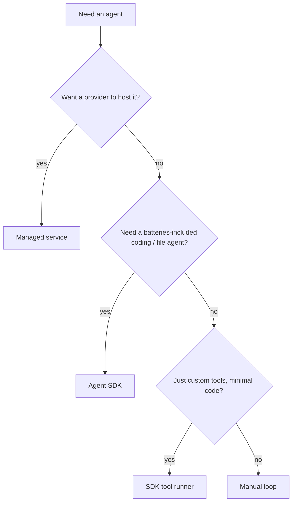

Mở rộng phần "build vs buy" ở [The agent harness](). Bạn
hiếm khi build agent từ đầu — có một cái thang từ *tự viết tất cả* đến *nhà cung cấp chạy hộ*.

## Bốn cách build một agent

| Cách | Bạn viết | Harness & hosting | Dùng khi |
| ------ | ---------- | ------------------- | ---------- |
| **Manual loop** | tự viết vòng lặp reason → act → observe | bạn dựng + bạn host | muốn toàn quyền, không phụ thuộc |
| **SDK tool runner** | chỉ các hàm tool của bạn | SDK chạy vòng lặp; bạn host | agent custom-tool mà không phải tự viết vòng lặp |
| **Agent SDK** | một prompt + config | SDK là harness đầy đủ, có tool sẵn; bạn host | agent coding / file "đủ pin" trên hạ tầng của bạn |
| **Managed service** | config agent + kết quả tool | nhà cung cấp chạy vòng lặp *và* host sandbox | không muốn hạ tầng: hosted, stateful, theo lịch |

Ví dụ cụ thể: **Tool Runner của Anthropic API SDK** (`client.beta.messages.tool_runner`) là một
tool runner; **Claude Agent SDK** là một Agent SDK (Claude Code đóng gói thành thư viện);
**Anthropic Managed Agents** là một managed service.

## Đừng nhầm: Tool Runner vs Agent SDK

Nghe giống nhau nhưng khác:

- **Tool runner** nằm trong SDK của model API. Nó lặp trên các tool *bạn* định nghĩa — không có
  tool sẵn, không filesystem, bạn host phần tính toán.
- **Agent SDK** (ví dụ Claude Agent SDK) là một harness agent đầy đủ với tool sẵn (read, write,
  edit, bash, search), quản lý context, và subagent.

## Agent frameworks

**LangGraph** và **Microsoft Agent Framework (MAF)** là các thư viện orchestration độc lập nhà
cung cấp — bạn ghép các bước, state, và luồng multi-agent, và có thể đổi model bên dưới. Dùng khi
bạn muốn orchestration di động qua nhiều model và tool thay vì agent của một hãng.

## MCP servers

Dù build trên nền nào, [MCP]() cho phép nó kết nối tới tool và
dữ liệu qua một giao diện chuẩn — kết nối tới một MCP server có sẵn thay vì đấu nối tay từng tích
hợp. Đa số SDK và managed service đều dùng được MCP server.

## Deployment

- **Self-host** — bạn chạy vòng lặp trong server / container của mình và tự lo scaling, retry, state.
- **Managed** — nhà cung cấp host vòng lặp và một sandbox mỗi phiên, và có thể chạy agent theo lịch.

## Chọn thế nào

Ưu tiên lựa chọn đơn giản nhất phù hợp — đa số agent custom-tool là một tool runner. Chỉ dùng
framework hoặc managed service khi bạn thực sự cần thứ chúng thêm vào.
