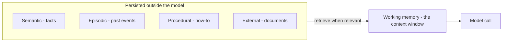

## Mục tiêu

Biết các loại bộ nhớ một [agent]() có thể có, và — quan
trọng hơn — **khi nào mỗi loại xứng đáng có mặt**. Memory là phần bị over-engineer nhất trong
thiết kế agent: mỗi loại thêm vào là thêm state phải lưu, truy xuất, bảo mật và giữ tươi.

## Xuất phát từ một sự thật

Bản thân model không nhớ gì giữa các lần gọi — "bộ nhớ" duy nhất của nó là những gì harness
đặt vào [context window]() ở lượt này. Mọi
loại memory bên dưới chỉ là các chiến lược khác nhau cho câu hỏi *lưu gì bên ngoài model và
khi nào nạp lại vào*.

## Các loại, và khi nào bạn cần

| Loại | Nó giữ gì | Thêm vào khi… |
| ------ | ------ | ------ |
| **Working** | Những gì đang trong context window ngay lúc này | Luôn luôn — đây là mức nền, do [harness]() quản lý |
| **Semantic** | Sự kiện và sở thích bền vững ("khách dùng gói Pro", "trả lời bằng tiếng Việt") | Người dùng phải lặp lại chính mình qua các phiên |
| **Episodic** | Sự kiện và kết quả trong quá khứ ("lần deploy trước fail ở migration") | Agent lặp lại lỗi nó đã từng mắc |
| **Procedural** | Cách làm việc — prompt, skill, runbook | Agent tự suy diễn lại cùng một quy trình mỗi lần (xem [Skills]()) |
| **External** | Tri thức tài liệu trong vector store, lấy về qua [RAG]() | Tri thức không vừa context và thay đổi thường xuyên |
| **Parametric** | Những gì model học lúc huấn luyện — đóng băng trong trọng số | Không thêm được lúc runtime — vì thế mới có cutoff; vá lỗ hổng bằng RAG hoặc [fine-tuning]() |
| **Prospective** | Việc cần làm sau ("theo dõi tiếp khi CI chạy xong") | Agent phải hành động theo sự kiện tương lai, không chỉ lượt hiện tại |

## Triệu chứng → loại memory

Đi ngược từ chỗ hỏng, đừng đi xuôi từ taxonomy:

| Triệu chứng | Thiếu gì |
| ------ | ------ |
| Quên chỉ dẫn giữa chừng tác vụ | Quản lý working memory (trim/tóm tắt), không phải thêm kho chứa |
| Hỏi người dùng cùng một điều mỗi phiên | Semantic |
| Lặp lại lỗi đã mắc tuần trước | Episodic |
| Mỗi lần giải một việc quen theo một kiểu khác (và tệ hơn) | Procedural |
| Không biết tài liệu của bạn | External (RAG) |
| Kiến thức lỗi thời | Giới hạn parametric — RAG hoặc fine-tune, không có cách vá runtime |

## Ví dụ — stack bộ nhớ của một support agent

Lượt 1 của phiên: harness nạp thread ticket (working), gói dịch vụ và ngôn ngữ của khách
(semantic), ghi chú rằng sự cố trước của khách này từng bị escalate nhầm (episodic), runbook
hoàn tiền (procedural), và truy xuất các đoạn chính sách liên quan (external). Năm loại, một
context window — mỗi loại được nạp *vì một lần hỏng trong quá khứ đòi hỏi nó*, không phải vì
sơ đồ có sẵn ô đó.

## Điểm mạnh & hạn chế

- **Điểm mạnh** — tính liên tục qua các phiên là thứ tách một trợ lý khỏi một chatbot
  stateless; episodic + procedural memory là cách agent *giỏi lên* thay vì xuất phát từ số
  không mỗi lần chạy.
- **Hạn chế** — memory đã lưu sẽ cũ đi và sai một cách tự tin (khách đã chuyển đi, chính sách
  đã đổi); truy xuất có thể lôi lên *nhầm* memory và đầu độc cả lượt; dữ kiện cá nhân kéo theo
  nghĩa vụ riêng tư và thời hạn lưu (xem
  [Responsible AI]()); mỗi kho chứa là hạ tầng
  phải vận hành và đồng bộ.

> Bắt đầu chỉ với working memory. Thêm từng loại một, khi một triệu chứng thật xuất hiện —
> đừng bao giờ thêm cả bảy vì sơ đồ vẽ bảy ô.

## Nguồn

- Sumers et al., *Cognitive Architectures for Language Agents (CoALA)* (2023) — [arXiv:2309.02427](https://arxiv.org/abs/2309.02427)
- Packer et al., *MemGPT: Towards LLMs as Operating Systems* (2023) — [arXiv:2310.08560](https://arxiv.org/abs/2310.08560)
- [Anthropic — Effective context engineering for AI agents](https://www.anthropic.com/engineering/effective-context-engineering-for-ai-agents)
