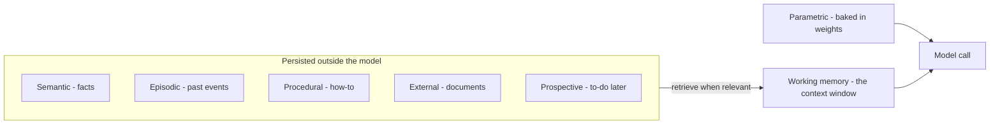
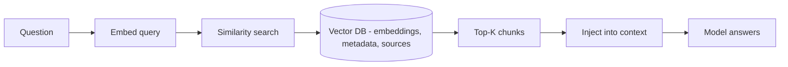
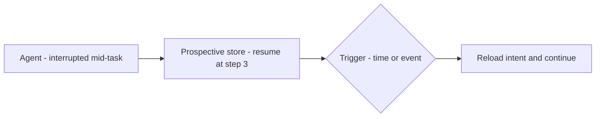

## Mục tiêu

Biết các loại bộ nhớ một [agent]() có thể có, mỗi loại
*là gì*, và — quan trọng nhất — **khi nào mỗi loại xứng đáng có mặt**. Memory là phần bị
over-engineer nhất trong thiết kế agent: mỗi loại thêm vào là thêm state phải lưu, truy xuất,
bảo mật và giữ tươi.

## Xuất phát từ một sự thật

Bản thân model không nhớ gì giữa các lần gọi — "bộ nhớ" duy nhất của nó là những gì harness
đặt vào [context window]() ở lượt này.
**Working memory** *chính là* cửa sổ đó; sáu loại kia là các chiến lược lưu thứ gì đó bên
ngoài model và nạp lại vào khi cần.

## Bảy loại

### 1. Working memory — cửa sổ context đang hoạt động

**Là gì** — mọi thứ model "thấy" ngay lúc này: các tin nhắn hiện tại, system prompt, output
của tool, và các bước suy luận. **Khi nào cần** — luôn luôn; đây là mức nền, do
[harness]() quản lý (thường có *checkpointer* gắn với
một thread id để cuộc hội thoại resume được). **Ví dụ** — hỏi *"vừa nãy tôi nói gì?"* và nó
trả lời bằng cách nhìn lại trong cửa sổ. Phần engineering ở đây là
[quản lý context](): trim hoặc tóm tắt khi
đầy, nếu không run sẽ vỡ.

### 2. Semantic memory — kiến thức bền lâu

**Là gì** — các sự kiện, sở thích, hồ sơ bền vững về người dùng hoặc chủ đề. **Khi nào cần** —
người dùng phải lặp lại chính mình qua các phiên, hoặc câu trả lời cần cá nhân hóa và nhất
quán. **Lưu ở đâu** — một [vector DB]() hoặc
profile store. **Ví dụ** — agent lưu *"user thích đơn vị mét"* và áp dụng ở mọi phiên sau mà
không cần được nhắc lại.

### 3. Episodic memory — trải nghiệm để học

**Là gì** — bản ghi các sự kiện đã qua: hội thoại đầy đủ, kết quả tác vụ, thành công và thất
bại, kèm timestamp. **Khi nào cần** — agent lặp lại lỗi đã mắc, hoặc cần audit trail. **Lưu ở
đâu** — một event/log store, truy xuất theo tương đồng. **Ví dụ** — **Reflexion**: agent viết
một self-reflection sau mỗi lần thất bại, lưu lại, và tái dùng lần sau — đạt 91% trên một
benchmark code so với 80% của GPT-4. Bài học: episodic memory là cách agent *giỏi lên* thay vì
xuất phát lại từ số không.

### 4. Procedural memory — cách làm việc

**Là gì** — tri thức về *cách* hoàn thành tác vụ: skills, workflow, mẫu dùng tool, và luật
hành vi. **Khi nào cần** — agent tự suy diễn lại cùng một quy trình mỗi lần chạy. **Lưu ở
đâu** — [skills](), tool schema, prompt template, và
script. **Ví dụ** — **Voyager** (một agent Minecraft) xây một thư viện skill chạy được và, với
tác vụ mới, tái dùng và ghép các skill sẵn có thay vì giải lại từ đầu. Tool cho agent *năng
lực*; procedural memory cho nó *quy trình*.

### 5. External memory — mang tri thức ngoài vào

**Là gì** — tri thức giữ bên ngoài model trong một vector DB, lấy về lúc inference bằng
similarity search. Đây *chính là* [RAG](). **Khi nào cần** —
tri thức quá lớn cho context window và thay đổi thường xuyên. **Ví dụ** — một support agent
embed tài liệu của bạn, lưu lại, và truy xuất các chunk liên quan nhất khi user hỏi.

### 6. Parametric memory — nằm trong trọng số

**Là gì** — tri thức học được lúc huấn luyện và lưu thẳng trong trọng số model: ngôn ngữ, mẫu
suy luận, kiến thức thế giới. **Khi nào cần** — bạn không *thêm* nó lúc runtime; nó luôn ở đó,
tức thì, không cần truy xuất. **Đánh đổi** — nhanh nhất và rẻ nhất, nhưng đóng băng ở mốc
huấn luyện và khó cập nhật hay audit. **Ví dụ** — model biết REST API là gì mà không cần được
dạy, nhưng không biết một thư viện ra tháng trước. Vá lỗ hổng đó bằng external memory hoặc
[fine-tuning]() — không bao giờ lúc runtime.

### 7. Prospective memory — nhớ việc phải làm tiếp

**Là gì** — các ý định tương lai và mục tiêu đã lên lịch mà agent đã cam kết nhưng chưa thực
thi: pending task, goal stack, reminder. **Khi nào cần** — agent long-horizon phải hành động
theo sự kiện tương lai, không chỉ lượt hiện tại. **Lưu ở đâu** — một task queue hoặc reminder
log, kích bởi trigger time/event/agent. **Ví dụ** — agent xong bước 2 trong 5, bị ngắt, và
log *"resume ở bước 3 với các input này"*; khi khởi động lại nó đọc ý định và tiếp tục đúng
chỗ đã dừng.

## Triệu chứng → loại memory

Đi ngược từ chỗ hỏng, đừng đi xuôi từ taxonomy:

| Triệu chứng | Thiếu gì |
| ------ | ------ |
| Quên chỉ dẫn giữa chừng tác vụ | Quản lý working memory (trim/tóm tắt), không phải thêm kho chứa |
| Hỏi người dùng cùng một điều mỗi phiên | Semantic |
| Lặp lại lỗi đã mắc tuần trước | Episodic |
| Mỗi lần giải một việc quen theo một kiểu khác (và tệ hơn) | Procedural |
| Không biết tài liệu của bạn | External (RAG) |
| Kiến thức lỗi thời | Giới hạn parametric — RAG hoặc fine-tune, không có cách vá runtime |
| Mất mạch một việc dài bị ngắt quãng | Prospective |

## Ví dụ — stack bộ nhớ của một support agent

Lượt 1 của phiên: harness nạp thread ticket (working), gói dịch vụ và ngôn ngữ của khách
(semantic), ghi chú rằng sự cố trước của khách này từng bị escalate nhầm (episodic), runbook
hoàn tiền (procedural), và truy xuất các đoạn chính sách liên quan (external). Năm loại, một
context window — mỗi loại được nạp *vì một lần hỏng trong quá khứ đòi hỏi nó*, không phải vì
sơ đồ có sẵn ô đó.

## Điểm mạnh & hạn chế

- **Điểm mạnh** — tính liên tục qua các phiên là thứ tách một trợ lý khỏi một chatbot
  stateless; episodic + procedural memory là cách agent *giỏi lên* thay vì xuất phát từ số
  không mỗi lần chạy.
- **Hạn chế** — memory đã lưu sẽ cũ đi và sai một cách tự tin (khách đã chuyển đi, chính sách
  đã đổi); truy xuất có thể lôi lên *nhầm* memory và đầu độc cả lượt; dữ kiện cá nhân kéo theo
  nghĩa vụ riêng tư và thời hạn lưu (xem
  [Responsible AI]()); mỗi kho chứa là hạ tầng
  phải vận hành và đồng bộ.

> Bắt đầu chỉ với working memory. Thêm từng loại một, khi một triệu chứng thật xuất hiện —
> đừng bao giờ thêm cả bảy vì sơ đồ vẽ bảy ô.

## Nguồn

- Sumers et al., *Cognitive Architectures for Language Agents (CoALA)* (2023) — [arXiv:2309.02427](https://arxiv.org/abs/2309.02427)
- Packer et al., *MemGPT: Towards LLMs as Operating Systems* (2023) — [arXiv:2310.08560](https://arxiv.org/abs/2310.08560)
- Shinn et al., *Reflexion: Language Agents with Verbal Reinforcement Learning* (2023) — [arXiv:2303.11366](https://arxiv.org/abs/2303.11366)
- Wang et al., *Voyager: An Open-Ended Embodied Agent with Large Language Models* (2023) — [arXiv:2305.16291](https://arxiv.org/abs/2305.16291)
- [Anthropic — Effective context engineering for AI agents](https://www.anthropic.com/engineering/effective-context-engineering-for-ai-agents)
