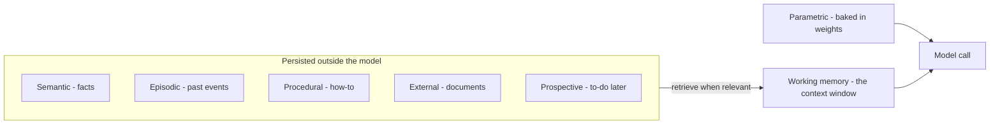

## Mục tiêu

Biết các loại bộ nhớ một [agent]() có thể có, mỗi loại *là gì*, và
— quan trọng nhất — **khi nào mỗi loại xứng đáng có mặt**. Memory là phần bị over-engineer
nhất trong thiết kế agent: mỗi loại thêm vào là thêm state phải lưu, truy xuất, bảo mật và
giữ tươi. Mỗi loại có trang riêng; đây là tấm bản đồ.

## Xuất phát từ một sự thật

Bản thân model không nhớ gì giữa các lần gọi — "bộ nhớ" duy nhất của nó là những gì harness
đặt vào [context window]() ở lượt này. **Working
memory** *chính là* cửa sổ đó; sáu loại kia là các chiến lược lưu thứ gì đó bên ngoài model
và nạp lại vào khi cần.

## Bảy loại

| Loại | Một dòng | Thêm vào khi… |
| ------ | ------ | ------ |
| [Working]() | Cửa sổ context đang hoạt động | Luôn luôn — mức nền |
| [Semantic]() | Sự kiện, sở thích bền vững | User phải lặp lại chính mình qua các phiên |
| [Episodic]() | Sự kiện và kết quả đã qua | Agent lặp lại lỗi cũ |
| [Procedural]() | Cách làm việc | Tự suy diễn lại cùng quy trình mỗi lần |
| [External]() | Tài liệu trong vector DB (RAG) | Tri thức lớn và thay đổi thường xuyên |
| [Parametric]() | Tri thức nằm trong trọng số | Không bao giờ thêm lúc runtime — nó luôn ở đó |
| [Prospective]() | Việc phải làm sau | Việc dài hạn, resume sau khi bị ngắt |

## Triệu chứng → loại memory

Đi ngược từ chỗ hỏng, đừng đi xuôi từ taxonomy:

| Triệu chứng | Thiếu gì |
| ------ | ------ |
| Quên chỉ dẫn giữa chừng tác vụ | Quản lý working memory (trim/tóm tắt), không phải thêm kho chứa |
| Hỏi người dùng cùng một điều mỗi phiên | Semantic |
| Lặp lại lỗi đã mắc tuần trước | Episodic |
| Mỗi lần giải một việc quen theo một kiểu khác (và tệ hơn) | Procedural |
| Không biết tài liệu của bạn | External (RAG) |
| Kiến thức lỗi thời | Giới hạn parametric — RAG hoặc fine-tune, không có cách vá runtime |
| Mất mạch một việc dài bị ngắt quãng | Prospective |

## Ví dụ — stack bộ nhớ của một support agent

Lượt 1 của phiên: harness nạp thread ticket (working), gói dịch vụ và ngôn ngữ của khách
(semantic), ghi chú rằng sự cố trước của khách này từng bị escalate nhầm (episodic), runbook
hoàn tiền (procedural), và truy xuất các đoạn chính sách liên quan (external). Năm loại, một
context window — mỗi loại được nạp *vì một lần hỏng trong quá khứ đòi hỏi nó*, không phải vì
sơ đồ có sẵn ô đó.

## Điểm mạnh & hạn chế

- **Điểm mạnh** — tính liên tục qua các phiên là thứ tách một trợ lý khỏi một chatbot
  stateless; episodic + procedural memory là cách agent *giỏi lên* thay vì xuất phát từ số
  không mỗi lần chạy.
- **Hạn chế** — memory đã lưu sẽ cũ đi và sai một cách tự tin (khách đã chuyển đi, chính sách
  đã đổi); truy xuất có thể lôi lên *nhầm* memory và đầu độc cả lượt; dữ kiện cá nhân kéo theo
  nghĩa vụ riêng tư và thời hạn lưu (xem
  [Responsible AI]()); mỗi kho chứa là hạ tầng phải vận hành
  và đồng bộ.

> Bắt đầu chỉ với working memory. Thêm từng loại một, khi một triệu chứng thật xuất hiện —
> đừng bao giờ thêm cả bảy vì sơ đồ vẽ bảy ô.

## Nguồn

- Sumers et al., *Cognitive Architectures for Language Agents (CoALA)* (2023) — [arXiv:2309.02427](https://arxiv.org/abs/2309.02427)
- Packer et al., *MemGPT: Towards LLMs as Operating Systems* (2023) — [arXiv:2310.08560](https://arxiv.org/abs/2310.08560)
- [Anthropic — Effective context engineering for AI agents](https://www.anthropic.com/engineering/effective-context-engineering-for-ai-agents)
