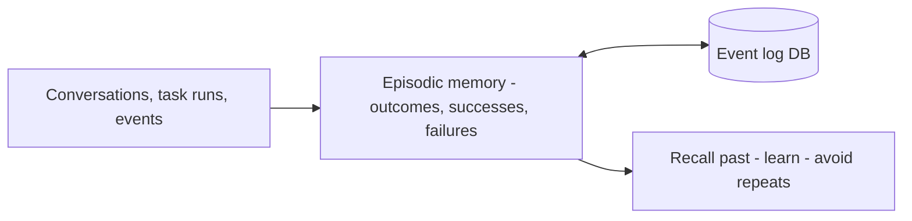

*Trải nghiệm để học.*

## Là gì

Bản ghi các sự kiện đã qua: hội thoại đầy đủ, kết quả tác vụ, thành công và thất bại, kèm
timestamp. Đây là cách agent học từ lịch sử của chính nó thay vì xuất phát lại từ số không.

## Khi nào cần

Agent lặp lại lỗi đã mắc, hoặc bạn cần một audit trail về chuyện gì đã xảy ra và vì sao.

## Lưu ở đâu

Một event/log store, truy xuất theo tương đồng với tình huống hiện tại.

## Ví dụ

**Reflexion**: agent viết một self-reflection sau mỗi lần thất bại, lưu lại, và tái dùng lần
sau — đạt 91% trên một benchmark code so với 80% của GPT-4. Episodic memory là cách agent
*giỏi lên* qua từng run.

## Nguồn

- Shinn et al., *Reflexion: Language Agents with Verbal Reinforcement Learning* (2023) — [arXiv:2303.11366](https://arxiv.org/abs/2303.11366)
