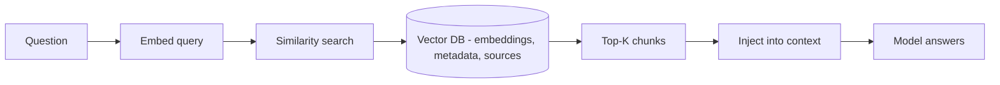

*Mang tri thức ngoài vào.*

## Là gì

Tri thức giữ bên ngoài model trong một vector DB, lấy về lúc inference bằng similarity search.
Đây *chính là* [RAG](), nhìn qua lăng kính memory.

## Khi nào cần

Tri thức quá lớn để giữ trong context window và thay đổi thường xuyên — nên bạn tra khi cần
thay vì nhồi sẵn vào.

## Lưu ở đâu

Một [vector database](), chứa embedding, metadata,
và tham chiếu nguồn để trích dẫn.

## Ví dụ

Một support agent embed tài liệu của bạn, lưu lại, và truy xuất các chunk liên quan nhất khi
user hỏi — neo câu trả lời và trích nguồn.

## Liên quan

- [RAG]() và [Vector databases]() — cơ chế đầy đủ.
- Khác [semantic memory](): external là *tài liệu của bạn*, semantic là *dữ kiện học về user*.
