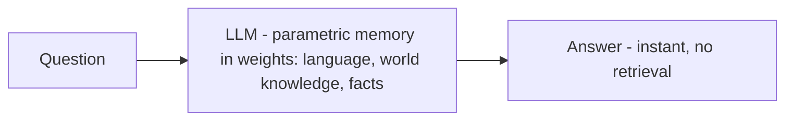

*Tri thức nằm trong trọng số.*

## Là gì

Tri thức học được lúc huấn luyện và lưu thẳng trong trọng số model: ngôn ngữ, mẫu suy luận,
kiến thức thế giới, sự kiện. Không cần truy xuất — nó *ở sẵn đó*.

## Khi nào cần

Bạn không *thêm* nó lúc runtime — nó luôn có sẵn, là bộ nhớ nhanh nhất và rẻ nhất. Câu hỏi
thiết kế là *dựa* vào nó cho cái gì so với lấy từ ngoài.

## Đánh đổi

Tức thì và miễn phí lúc inference, nhưng **đóng băng ở mốc huấn luyện** và khó cập nhật hay
audit. Vá lỗ hổng bằng [external memory]() (tươi, trích dẫn
được) hoặc [fine-tuning]() (hành vi mới) — không bao
giờ lúc runtime.

## Ví dụ

Model biết REST API là gì mà không cần được dạy, nhưng không biết một thư viện ra tháng trước.
Cái đầu là parametric; cái sau cần external memory.

## Liên quan

- [How models are trained]() — cách tri thức vào trọng số.
- [Adaptation]() — khi nào fine-tune so với truy xuất.
