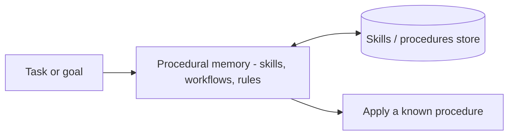

*Tri thức về cách làm việc.*

## Là gì

Tri thức về *cách* hoàn thành tác vụ: skills, workflow, mẫu dùng tool, và luật hành vi. Tool
cho agent *năng lực*; procedural memory cho nó *quy trình*.

## Khi nào cần

Agent tự suy diễn lại cùng một quy trình mỗi lần chạy thay vì tái dùng một cái đã biết là tốt.

## Lưu ở đâu

[Skills](), tool schema, prompt template, và script —
một thư viện agent dựa vào.

## Ví dụ

**Voyager** (một agent Minecraft) xây một thư viện skill chạy được và, với tác vụ mới, tái
dùng và ghép các skill sẵn có thay vì giải lại từ đầu.

## Nguồn

- Wang et al., *Voyager: An Open-Ended Embodied Agent with Large Language Models* (2023) — [arXiv:2305.16291](https://arxiv.org/abs/2305.16291)
