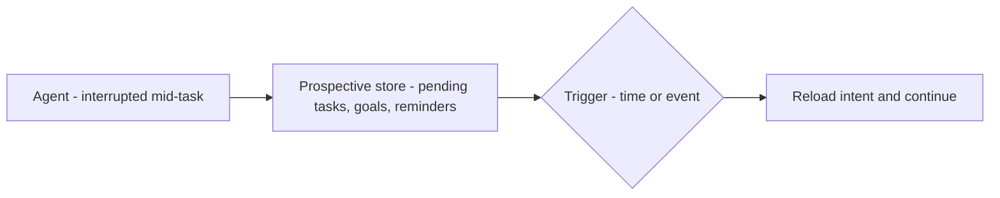

*Nhớ việc phải làm tiếp.*

## Là gì

Các ý định tương lai và mục tiêu đã lên lịch mà agent đã cam kết nhưng chưa thực thi: pending
task, goal stack, reminder. Đây là cách một agent long-horizon sống sót qua các lần bị ngắt.

## Khi nào cần

Agent long-horizon phải hành động theo sự kiện tương lai — không chỉ đáp lượt hiện tại — và
các việc kéo dài qua các lần ngắt hoặc khởi động lại.

## Lưu ở đâu

Một task queue, goal stack, hoặc reminder log, kích bởi trigger time / event / agent.

## Ví dụ

Agent xong bước 2 trong 5, bị ngắt, và log *"resume ở bước 3 với các input này."* Khi khởi
động lại nó đọc ý định và tiếp tục đúng chỗ đã dừng, thay vì mất mạch.

## Liên quan

- [Loop engineering]() — các loop chạy dài dựa vào prospective state.
- [The agent harness]() — nơi điều kiện dừng/resume nằm.
